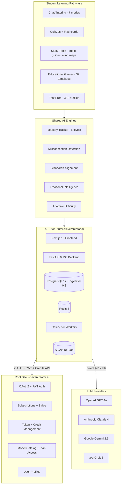

# AI Tutor v3.1 — Implementation Plan

> **Design Document**: [AI_TUTOR_MODULE.md](AI_TUTOR_MODULE.md)
> **Size**: 3,840 lines | 36 sections | ~50 weeks total (Phases 1-4) + Phase 5 ongoing
> **Stack**: Python FastAPI · Next.js / React / TypeScript · PostgreSQL + pgvector · Redis · Celery
> **Architecture**: Fully independent app · Docker containerized · Root site API integration
> **Last Updated**: March 2026

---

## Change Log

### v1.0 — Initial Draft
- Vision, personas, 4 interaction modes, basic feature list, original roadmap

### v2.0 — Architecture Overhaul
- Single-tenancy integrated with clevercreator.ai root site
- Python FastAPI + Next.js stack (replacing Laravel)
- Root site API integration (OAuth, JWT, credits, catalog)
- ChatterMate as reference architecture (not dependency)
- 15 pedagogical innovations ("outside the box" features)
- Detailed database schema, API endpoints, backend/frontend architecture
- 5-phase implementation roadmap

### v3.0 — Study Tools, Test Prep & Tech Pinning
- Pinned tech stack versions (March 2026 latest stable)
- 13 AI Study Tools (NotebookLM/Quizlet/Duolingo-inspired)
- Test prep framework with IELTS deep module (9 test profiles)
- 7 interaction modes (added Debate/Roleplay)
- Competitive feature matrix (vs 5 competitors)
- Detailed roadmap with numbered sub-steps per sprint

### v3.1 — Gaming Engine & Expanded Test Prep (Current)
- Educational Gaming Engine (32 game templates across 4 age bands)
- Multi-pathway learning system (chat, quiz, game, audio, test prep)
- 30+ test prep profiles (added PSAT, SHSAT, ISEE, SSAT, HSPT, GED, GMAT, LSAT, MCAT, STEAM, AMC, state exams)
- Updated roadmap with Sprint 3.6 (gaming) and Sprint 5.3-5.4 (tests + games)
- Competitive matrix expanded with Prodigy + 5 new comparison rows

---

## Architecture Overview

---

## Pinned Tech Stack (March 2026)

| Layer | Technology | Version |
|---|---|---|
| Frontend | Next.js (App Router) | 16.1.6 |
| React | React + React DOM | 19.2.4 |
| TypeScript | TypeScript | 5.7.x |
| UI Framework | Tailwind CSS + shadcn/ui | Tailwind 4.x + shadcn 4.0.2 |
| State | Zustand | 5.0.11 |
| Backend | FastAPI + uvicorn | 0.135.1 |
| Python | Python runtime | 3.13.x |
| Validation | Pydantic | 2.12.5 |
| Database | PostgreSQL + pgvector | PG 17.9 + pgvector 0.8.2 |
| DB Driver | asyncpg | 0.31.0 |
| Cache/Queue | Redis + Celery | Redis 8.6.0 + Celery 5.6 |
| HTTP Client | httpx | 0.28.1 |
| Math | KaTeX + MathLive | 0.16.x + 0.108.3 |
| Whiteboard | tldraw | 4.3.0 |
| Code Editor | Monaco Editor | 0.55.1 |
| TTS/STT | OpenAI Whisper + TTS API | latest |

---

## Complete Feature List by Section

### Core Platform (Sections 1-19)
1. **Vision & Philosophy** — Socratic, adaptive, age-appropriate, teacher-trainable
2. **Ecosystem Architecture** — Independent app, root site API, optional ChatterMate/Forge
3. **Technology Stack** — Pinned versions, AI-native stack
4. **System Architecture** — Mermaid diagrams, all engine subgraphs
5. **Authentication** — OAuth 2.0 via root site, JWT, credits estimate/reserve/reconcile
6. **Feature Overview** — Checklist by phase
7. **User Roles** — Student, teacher, parent, admin (RBAC)
8. **User Journey** — Sequence diagrams for all flows
9. **Tutor Personas** — 6 base personas with distinct personalities
10. **Interaction Modes** — 7 modes (Teach Me, Quiz Me, Hint, Apply It, Show Thinking, Writing Workshop, Debate/Roleplay)
11. **Chat Interface** — Message bubbles, KaTeX, code highlighting, streaming
12. **Age-Adaptive UI** — 4 grade-band layouts (K-2, 3-5, 6-8, 9-12)
13. **Adaptive Learning Engine** — 5-level mastery, misconception detection, interleaving
14. **RAG Pipeline** — Document upload, semantic chunking, pgvector search, citations
15. **AI Engine** — 4 providers, 8-layer prompt builder, model router, safety layer
16. **Session Workflow** — Full sequence diagram with credit flow
17. **Standards Alignment** — Common Core, NGSS import and mapping
18. **Teacher Portal** — Class management, KB upload, AI co-pilot, analytics
19. **Parent Dashboard** — Progress, reports, controls, co-learning mode

### Innovations (Section 20)
15 pedagogical innovations: Show Your Thinking, Misconception Detection, Knowledge Graph, Emotional Intelligence, Age-Adaptive UI, "Why Am I Learning This?", Mistake Journal, Interleaving, Teacher AI Co-Pilot, Micro-Tutoring, Parent Co-Learning, Digital Portfolio, Homework Scanner, Content Freshness, Wellness Guardian

### AI Study Tools (Section 21)
13 features inspired by NotebookLM, Quizlet, Duolingo Max, Photomath, Khanmigo:
1. Audio Lesson Generator ("Deep Dive") — podcast-style via TTS
2. URL-Based Learning — paste URL or YouTube, AI teaches from it
3. Auto-Generated Study Guides — from topics, KB, or URLs
4. Mind Map Generation — interactive with mastery overlay
5. Magic Notes — upload notes, auto-generate flashcards + quiz
6. Brain Beats — convert flashcards to songs
7. Memory Score — retention prediction + review scheduling
8. Quick Summary — one-click summary of any content
9. AI Video Call — video conversation with tutor character (Phase 5)
10. Roleplay Scenarios — subject-appropriate roleplay
11. Explain My Answer — detailed quiz answer explanation
12. Lecture Recording Ingestion — Whisper transcription + study materials
13. Photo-Based Problem Solving — animated step-by-step walkthrough

### Educational Gaming Engine (Section 22)
Optional game-based learning pathway — same mastery outcomes, different engagement vehicle:

**K-2 Games (7)**: Story Adventure, Matching, Coloring Challenge, Treasure Hunt, Rhythm Game, Virtual Pet, Storytime Builder

**3-5 Games (8)**: RPG Quest, Building Game, Mystery Detective, Team Challenge, Experiment Lab, Word Factory, Timeline Builder, Fraction Pizza Shop

**6-8 Games (8)**: Escape Room, Civilization Builder, Speed Challenge, Virtual Science Lab, Coding Maze, Debate Arena, Grammar Quest, Ecosystem Simulator

**9-12 Games (8)**: Business Simulation, Debate Tournament, Case Study Mystery, Entrepreneurship, Mock Trial, Model UN, Stock Market Sim, Research Lab

**Features**: Adaptive difficulty (ZPD), learning style adaptation (visual/auditory/kinesthetic/R+W), game-to-mastery integration, multiplayer/class challenges, teacher controls, AI game recommendations

### Test Prep Framework (Section 23)
30+ pluggable test profiles with descriptor-locked scoring:

**Phase 4**: IELTS Academic, IELTS General, SAT, PSAT/NMSQT, ACT, AP Exams
**Phase 5**: SHSAT, ISEE, SSAT, HSPT, GED, TOEFL iBT, Cambridge, GRE
**Phase 5+**: GMAT, LSAT, MCAT, STEAM, AMC/AIME, Science Olympiad, STAAR, Regents, MAP, SBAC, ASVAB, CLEP, CLT

**IELTS Deep Module**: AI Speaking Examiner (Parts 1-3), Writing Evaluation (band descriptor-locked), Reading (passage generation), Listening (AI audio with accent variety), Band prediction, Gap analysis

### Infrastructure (Sections 24-33)
24. Interactive Learning Tools (whiteboard, code sandbox, math editor)
25. Gamification & Motivation (XP, levels, streaks, badges, leaderboards)
26. Safety, Compliance & Privacy (COPPA, FERPA, GDPR)
27. Database Schema (25+ tables with SQL DDL)
28. API Endpoints (80+ endpoints)
29. Backend Architecture (16 route files, 30+ services, 9 Celery tasks)
30. Frontend Architecture (component map, state management)
31. AI Prompt Engineering (8-layer assembly with examples)
32. Deployment Architecture (Docker Compose, env config)
33. Multi-Language & Localization (i18n, RTL, 6 languages)

### Analysis (Sections 34-36)
34. Implementation Roadmap (380+ numbered sub-steps)
35. Key Design Decisions (28 decisions with rationale)
36. Competitive Feature Matrix (vs 6 competitors, 27 dimensions)

---

## Implementation Roadmap

### Phase 1: Foundation (8-10 weeks)

**Goal**: Working core tutor — students can chat with AI tutors, teachers can upload materials, auth and credits work end-to-end.

#### Sprint 1.1 — Project Scaffolding & DevOps (Week 1-2)
- [ ] 1.1.1 Initialize Python project (pyproject.toml, Poetry/uv, Python 3.13)
- [ ] 1.1.2 FastAPI app skeleton with router structure
- [ ] 1.1.3 Pydantic v2 settings management
- [ ] 1.1.4 Structured logging (structlog + OpenTelemetry)
- [ ] 1.1.5 asyncpg connection pool with health checks
- [ ] 1.1.6 Next.js 16 project with App Router + TypeScript strict
- [ ] 1.1.7 Tailwind 4 + shadcn/ui 4 setup and theming
- [ ] 1.1.8 Zustand 5 store skeleton (auth, session, ui, chat)
- [ ] 1.1.9 API client layer with fetch wrapper
- [ ] 1.1.10 Layout shell: sidebar, header, main content
- [ ] 1.1.11 Docker Compose (api, frontend, db, redis, celery, sandbox)
- [ ] 1.1.12 PostgreSQL init.sql with all tables + indexes
- [ ] 1.1.13 Seed data SQL (personas, subjects, topics, standards)
- [ ] 1.1.14 Makefile / scripts (dev, test, migrate, seed, lint, format)
- [ ] 1.1.15 CI pipeline skeleton (GitHub Actions)

#### Sprint 1.2 — Authentication & Root Site Integration (Week 3)
- [ ] 1.2.1 RootSiteClient service (OAuth, JWT, user, credits, catalog)
- [ ] 1.2.2 Auth middleware (JWT verify, user context injection)
- [ ] 1.2.3 Internal X-Auth-Hex for service-to-service
- [ ] 1.2.4 Token service (estimate, reserve, reconcile)
- [ ] 1.2.5 Frontend OAuth redirect flow + cookie storage
- [ ] 1.2.6 Protected route HOC + auth context provider
- [ ] 1.2.7 Login/logout flow with root site redirect
- [ ] 1.2.8 Tutor user sync on first login
- [ ] 1.2.9 Role-based access control (student, teacher, parent, admin)
- [ ] 1.2.10 Rate limiting middleware (Redis-backed)

#### Sprint 1.3 — Core Tutoring Engine (Week 4-5)
- [ ] 1.3.1 BaseProvider abstract class
- [ ] 1.3.2 OpenAI provider (GPT-4o, GPT-4o-mini)
- [ ] 1.3.3 Anthropic provider (Claude 4 Sonnet, Haiku)
- [ ] 1.3.4 Gemini provider (Gemini 2.5 Pro, Flash)
- [ ] 1.3.5 Grok provider (Grok-3, Grok-3-mini)
- [ ] 1.3.6 Provider registry with model metadata
- [ ] 1.3.7 Streaming SSE endpoint
- [ ] 1.3.8 Error handling: retry, fallback, timeout
- [ ] 1.3.9-1.3.16 8-layer prompt builder (persona, custom, mode, RAG, mastery, interests, standards, history)
- [ ] 1.3.17-1.3.20 Session management (CRUD, history, state, summaries)
- [ ] 1.3.21-1.3.26 Safety layer (input/output moderation, age filter, anti-cheat, PII, guardrails)
- [ ] 1.3.27-1.3.32 All 7 interaction modes

#### Sprint 1.4 — RAG Pipeline & Teacher Dashboard (Week 6-7)
- [ ] 1.4.1-1.4.11 RAG pipeline (upload, extract, chunk, embed, search, rerank, cite, KB CRUD, status, preview)
- [ ] 1.4.12-1.4.17 Teacher dashboard (classes, roster, KB management, persona customization, analytics, preview)
- [ ] 1.4.18-1.4.20 Student onboarding (profile, class join, interests)

#### Sprint 1.5 — UI Polish & Core UX (Week 8-10)
- [ ] 1.5.1-1.5.6 Chat interface (rendering, streaming, chips, starters, feedback, session panel)
- [ ] 1.5.7-1.5.10 Age-adaptive UI (K-2, 3-5, 6-8, 9-12 layouts)
- [ ] 1.5.11-1.5.14 Navigation (tutor selection, subject browser, session history, mobile)
- [ ] 1.5.15-1.5.20 Quality (errors, loading, keyboard nav, E2E tests, API tests, Lighthouse)

**Deliverable**: Working AI tutor with auth, 7 modes, streaming chat, RAG, teacher KB, age-adaptive UI

---

### Phase 2: Intelligence & Study Tools (8-10 weeks)

**Goal**: Smart tutoring — adaptive learning, mastery tracking, quizzes, flashcards, study tools, URL learning.

#### Sprint 2.1 — Hint Engine & Quiz System (Week 1-2)
- [ ] 2.1.1-2.1.6 3-level hint engine (server-enforced, prompt-controlled)
- [ ] 2.1.7-2.1.13 Quiz system (AI-generated, adaptive, misconception-aware, Explain My Answer)

#### Sprint 2.2 — Flashcards & Spaced Repetition (Week 3)
- [ ] 2.2.1-2.2.8 Flashcards (AI-generated, SM-2, CRUD, Magic Notes, scheduling, modes)

#### Sprint 2.3 — Study Tools (Week 4-5)
- [ ] 2.3.1-2.3.4 URL-based learning (web scraping, YouTube transcripts, session context, chat)
- [ ] 2.3.5-2.3.8 Auto-generated study guides (from topic, KB, weak areas, export)
- [ ] 2.3.9-2.3.13 Quick Summary + session summaries + email

#### Sprint 2.4 — Mastery & Adaptive Learning (Week 6-7)
- [ ] 2.4.1-2.4.5 Mastery tracking (5-level, per-topic, updates, decay, dashboard)
- [ ] 2.4.6-2.4.9 Misconception detection (patterns, analysis, remediation, alerts)
- [ ] 2.4.10-2.4.12 Diagnostic assessment (placement, gaps, starting point)
- [ ] 2.4.13-2.4.15 Learning path generation (AI-generated, visualization, adaptive)
- [ ] 2.4.16-2.4.18 Standards alignment (import, mapping, tracking)
- [ ] 2.4.19-2.4.21 Interleaving engine (mixed review, configurable ratio, priority)

#### Sprint 2.5 — Model Router & Advanced AI (Week 8-10)
- [ ] 2.5.1-2.5.6 Model router (complexity, cost, plan-gated, fallback, health, analytics)
- [ ] 2.5.7-2.5.10 Teacher KB enhancements (standards tagging, preview, analytics)

**Deliverable**: Adaptive tutor with mastery tracking, study tools, URL learning, cost-optimized AI routing

---

### Phase 3: Engagement, Interactive Tools & Gaming (11-13 weeks)

**Goal**: Fun and multi-modal — gamification, games, interactive tools, audio lessons, emotional intelligence.

#### Sprint 3.1 — Gamification System (Week 1-2)
- [ ] 3.1.1-3.1.8 XP, levels, streaks, badges, leaderboard, multipliers, celebrations, dashboard

#### Sprint 3.2 — Parent Dashboard & Co-Learning (Week 3-4)
- [ ] 3.2.1-3.2.6 Parent dashboard (progress, activity, reports, controls, consent, multi-child)
- [ ] 3.2.7-3.2.10 Co-learning mode (join session, parent guide, shared history, starters)

#### Sprint 3.3 — Interactive Tools (Week 5-6)
- [ ] 3.3.1-3.3.5 Digital whiteboard (tldraw embedded, draw-to-solve, AI draws, snapshots)
- [ ] 3.3.6-3.3.11 Code sandbox (Monaco, Docker, limits, AI review, debugging, challenges)
- [ ] 3.3.12-3.3.15 Math editor (MathLive input, MathJSON, step-by-step solving)

#### Sprint 3.4 — Audio Lessons & Memory Tools (Week 7-8)
- [ ] 3.4.1-3.4.5 Audio lesson generator (AI script, TTS, formats, player, teacher assign)
- [ ] 3.4.6-3.4.10 Mind map generation (react-flow, mastery overlay, click-to-learn, export)
- [ ] 3.4.11-3.4.13 Memory score (retention tracking, prediction, reminders)
- [ ] 3.4.14-3.4.16 Roleplay scenarios (subject-appropriate, personas, assessment)

#### Sprint 3.5 — Emotional Intelligence & Engagement (Week 9-10)
- [ ] 3.5.1-3.5.4 Emotional intelligence (frustration, confidence, boredom detection + response)
- [ ] 3.5.5-3.5.8 Knowledge graph visualization (concept map, mastery overlay, prerequisites)
- [ ] 3.5.9-3.5.12 Mistake journal (auto-log, patterns, review, teacher view)
- [ ] 3.5.13-3.5.15 "Why Am I Learning This?" engine
- [ ] 3.5.16-3.5.18 Notification system (in-app, email, push)

#### Sprint 3.6 — Educational Gaming Engine (Week 11-13)
- [ ] 3.6.1-3.6.8 Gaming framework (DB schema, API, adaptive difficulty, mastery integration, recommendations, assignments, leaderboard, pathway selector)
- [ ] 3.6.9-3.6.12 K-2 games (Story Adventure, Matching, Virtual Pet, Treasure Hunt)
- [ ] 3.6.13-3.6.16 3-5 games (RPG Quest, Building, Mystery Detective, Fraction Pizza Shop)
- [ ] 3.6.17-3.6.20 6-8 games (Escape Room, Civilization Builder, Coding Maze, Speed Challenge)
- [ ] 3.6.21-3.6.24 9-12 games (Business Sim, Debate Tournament, Case Study, Stock Market)
- [ ] 3.6.25-3.6.28 Cross-cutting (learning style layer, results dashboard, teacher analytics, XP integration)

**Deliverable**: Multi-modal platform with gamification, games, interactive tools, audio lessons, emotional adaptation, parent involvement

---

### Phase 4: Scale, Test Prep & Compliance (10-12 weeks)

**Goal**: Enterprise features — test prep, LMS integration, marketplace, compliance, i18n.

#### Sprint 4.1 — Test Prep Framework (Week 1-3)
- [ ] 4.1.1-4.1.8 Test prep infrastructure (profiles, DB, scoring, mock tests, timer, prediction, gaps, study plan)
- [ ] 4.1.9-4.1.18 IELTS module (speaking AI examiner, writing evaluation, band prediction, reading, listening, progress)
- [ ] 4.1.19-4.1.24 SAT/ACT/PSAT/AP modules (sections, scoring, prediction, benchmarks)

#### Sprint 4.2 — LMS Integration & Teacher Tools (Week 4-5)
- [ ] 4.2.1-4.2.4 LMS (Google Classroom, Canvas LTI 1.3, assignment sync, grade passback)
- [ ] 4.2.5-4.2.9 Teacher AI co-pilot (lesson plans, assessments, class reports, differentiation, communication)
- [ ] 4.2.10-4.2.14 Content marketplace (sharing, cloning, flashcard decks, moderation, analytics)

#### Sprint 4.3 — Analytics & Homework Scanner (Week 6-7)
- [ ] 4.3.1-4.3.5 Advanced analytics (at-risk prediction, patterns, engagement, admin dashboard, exports)
- [ ] 4.3.6-4.3.11 Homework scanner (camera, OCR, identification, guided solving, visual walkthrough, batch)
- [ ] 4.3.12-4.3.14 Brain beats (lyric generation, audio player, K-5 focus)

#### Sprint 4.4 — Compliance, Accessibility & i18n (Week 8-10)
- [ ] 4.4.1-4.4.5 Compliance (COPPA, FERPA, GDPR, audit logging, retention policies)
- [ ] 4.4.6-4.4.11 Accessibility WCAG 2.1 AA (keyboard, screen reader, contrast, focus, alt text, audit)
- [ ] 4.4.12-4.4.16 Multi-language (next-intl, RTL, AI content in preferred language, ESL, auto-translation)
- [ ] 4.4.17-4.4.20 Wellness guardian (time limits, break reminders, quiet hours, parent config)
- [ ] 4.4.21-4.4.23 Micro-tutoring (quick review, daily concept, bus-stop audio)

**Deliverable**: Enterprise platform with IELTS/SAT/ACT test prep, LMS, marketplace, compliance, multi-language

---

### Phase 5: Beyond (ongoing)

**Goal**: Expand reach — mobile, voice, collaboration, 30+ test profiles, expanded games, university.

#### Sprint 5.1 — Mobile & Voice (Week 1-4)
- [ ] 5.1.1-5.1.3 PWA (service worker, offline caching, install prompt)
- [ ] 5.1.4-5.1.5 Voice (STT via Whisper, TTS for AI responses)
- [ ] 5.1.6-5.1.7 React Native (optional) + push notifications

#### Sprint 5.2 — Collaboration & Social (Week 5-8)
- [ ] 5.2.1-5.2.4 Study rooms (2-5 students + AI, shared whiteboard, group matching, peer tutoring)
- [ ] 5.2.5-5.2.6 AI Video Call (language subjects, pronunciation assessment)
- [ ] 5.2.7-5.2.8 Digital portfolio (curated work, college app export)

#### Sprint 5.3 — Additional Test Prep (Week 9-12)
- [ ] 5.3.1-5.3.4 High school admissions (SHSAT, ISEE, SSAT, HSPT)
- [ ] 5.3.5-5.3.7 International English extended (TOEFL, Cambridge, Duolingo English Test)
- [ ] 5.3.8-5.3.9 Graduate (GRE, GMAT)
- [ ] 5.3.10 General (GED)

#### Sprint 5.4 — Advanced Content, Games & University (Week 13-16+)
- [ ] 5.4.1-5.4.4 Content (science sims, current events, study scheduling, lecture ingestion)
- [ ] 5.4.5-5.4.7 University extension (course-level, research papers, citation helper)
- [ ] 5.4.8-5.4.11 Expanded games (new templates quarterly, community configs, tournaments, seasonal events)
- [ ] 5.4.12-5.4.20 Additional tests (LSAT, MCAT, STEAM, AMC, Science Olympiad, STAAR, Regents, MAP, SBAC, ASVAB, CLEP, CLT)
- [ ] 5.4.21-5.4.23 Infrastructure (edge AI, AR/VR APIs, Forge deep link)

**Deliverable**: Cross-platform, voice-enabled, 30+ test prep profiles, expanding game library, university support

---

## Key Design Decisions

| Decision | Rationale |
|---|---|
| Fully independent application | Own Docker, DB, codebase — no runtime dependency on ChatterMate |
| Root site API only | Auth, billing, credits, catalog via API — no duplication |
| FastAPI + Next.js | AI-native stack; Python for AI/ML ecosystem |
| Pinned tech stack | Latest stable March 2026 — avoid upgrade churn |
| PostgreSQL + pgvector | Single DB for relational + vector search |
| asyncpg, raw SQL, no ORM | Maximum performance and control |
| 7 interaction modes | Teach, Quiz, Hint, Apply, Show Thinking, Writing, Debate/Roleplay |
| 8-layer prompt assembly | Deepest context: persona + custom + mode + RAG + mastery + interests + standards + history |
| Multi-pathway learning | Chat, quiz, game, audio, test prep — AI recommends what works for each student |
| Educational games as optional pathway | Not replacement — same mastery outcomes, different engagement |
| 30+ pluggable test profiles | Descriptor-locked scoring, expandable framework |
| Server-enforced hints | Can't bypass by manipulating client |
| Misconception detection | Diagnoses WHY students are wrong |
| Emotional intelligence | Detects frustration from patterns, adapts without cameras/mics |
| Age-adaptive UI | 4 grade-band layouts — not one-size-fits-all |
| COPPA + FERPA | Non-negotiable for K-12 |

---

## Competitive Feature Matrix

| Feature | Khanmigo | Quizlet | Duolingo | Photomath | Prodigy | **Our Platform** |
|---|---|---|---|---|---|---|
| Socratic teaching | Yes | No | No | No | No | **Yes (7 modes)** |
| All subjects | Math-focused | Yes | Languages | Math only | Math only | **All subjects** |
| Custom KB / RAG | No | User decks | No | No | No | **Yes (full RAG)** |
| Flashcards + SR | No | Yes | No | No | No | **Yes (SM-2)** |
| Audio lessons | No | No | No | No | No | **Yes** |
| URL learning | No | No | No | No | No | **Yes** |
| Game-based learning | No | No | No | No | Math RPG | **All subjects, 4 age bands** |
| Learning style adapt | No | No | No | No | Limited | **V/A/K/RW** |
| Multi-pathway | No | No | No | No | No | **5 pathways + AI rec** |
| 30+ test prep | No | No | No | No | No | **Yes** |
| Age-adaptive UI | Limited | No | No | No | Yes | **4 layouts** |
| Emotional intel | No | No | No | No | No | **Yes** |
| Parent co-learning | No | No | No | No | Reports | **Co-learning + reports** |
| Whiteboard | No | No | No | No | No | **tldraw** |
| Code sandbox | No | No | No | No | No | **Docker** |
| LMS integration | No | Limited | No | No | Yes | **LTI 1.3** |
| Multiplayer | No | No | No | No | Limited | **Rooms + tournaments** |

---

## Document Stats

| Metric | Value |
|---|---|
| Version | 3.1 |
| Lines | 3,840 |
| Sections | 36 |
| Interaction modes | 7 |
| AI Study Tools | 13 |
| Game templates | 32 (4 age bands) |
| Test prep profiles | 30+ |
| API endpoints | 80+ |
| Database tables | 25+ |
| Backend services | 30+ |
| Celery tasks | 9 |
| Roadmap sub-steps | 380+ |
| Competitors benchmarked | 6 |
| Total timeline (Ph 1-4) | ~50 weeks |
