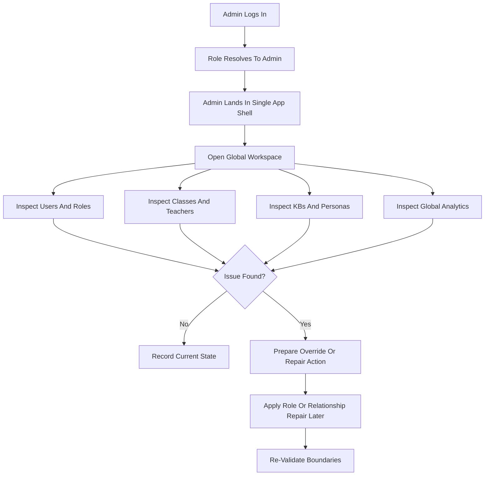
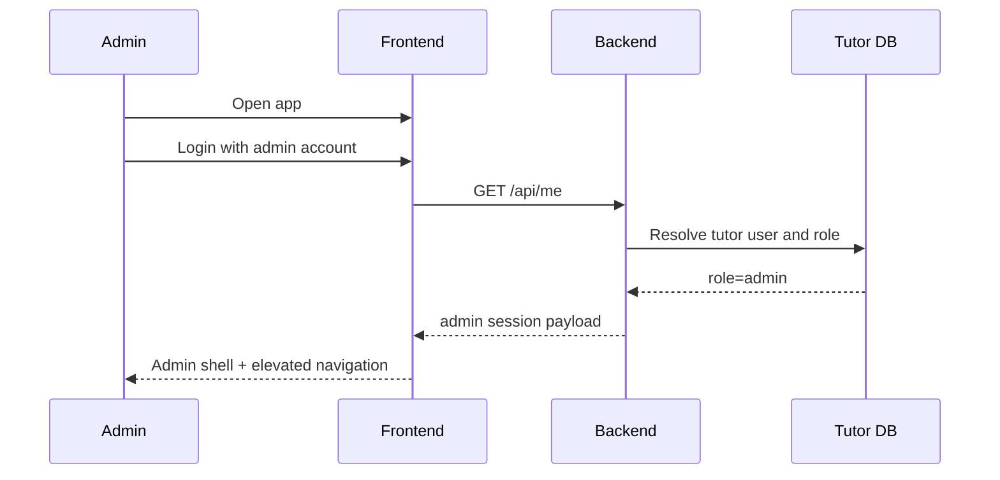
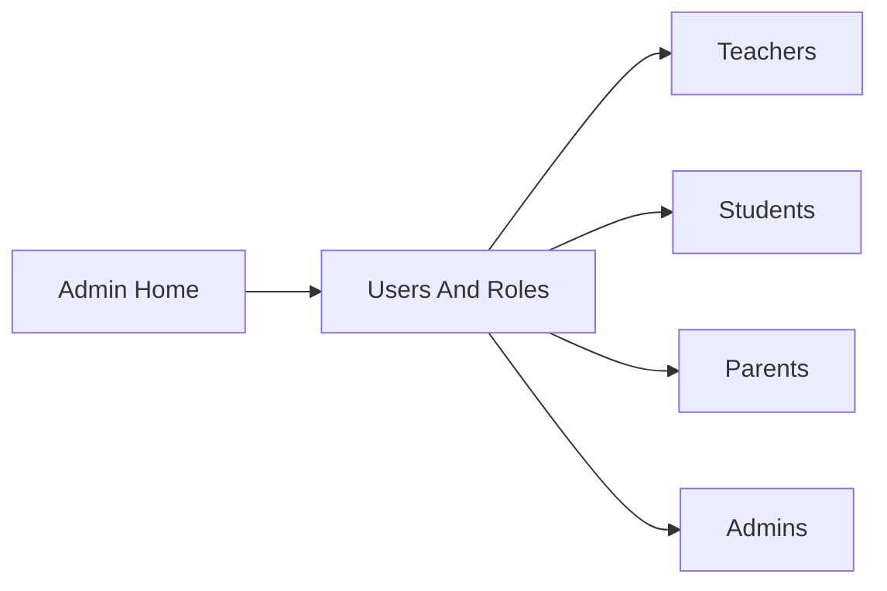
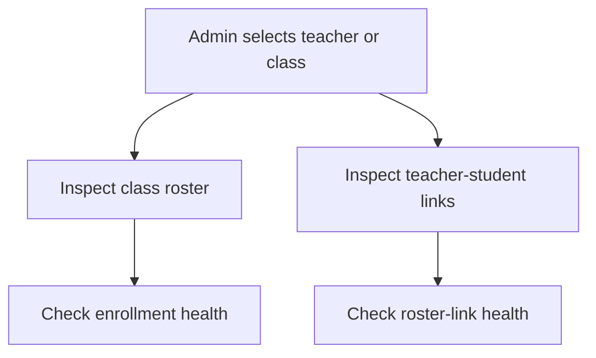
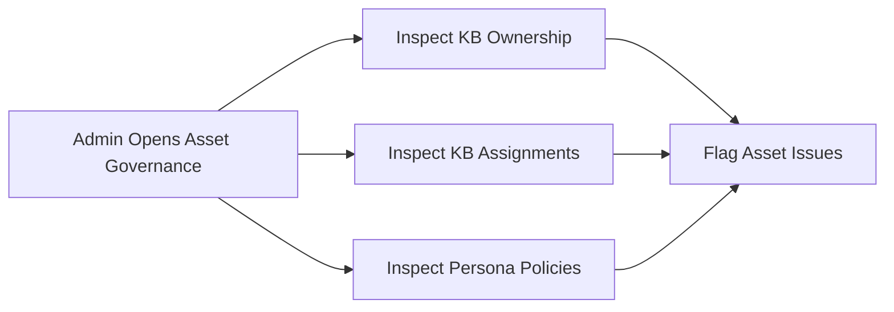
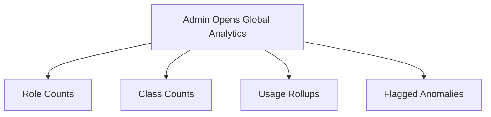
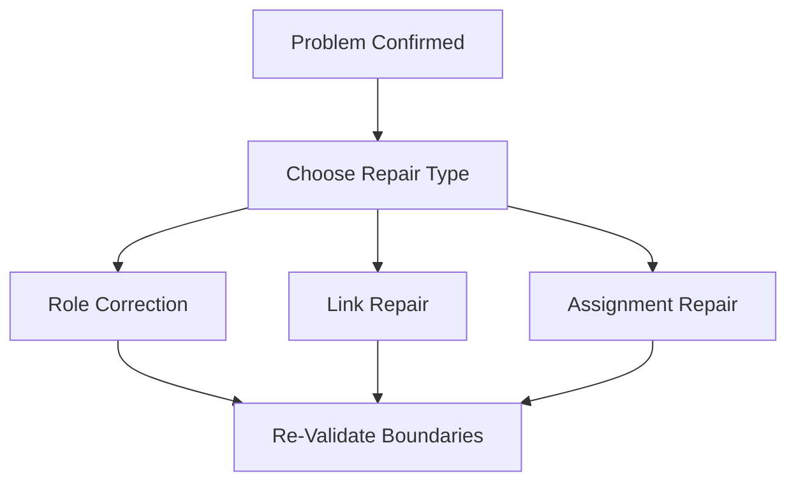
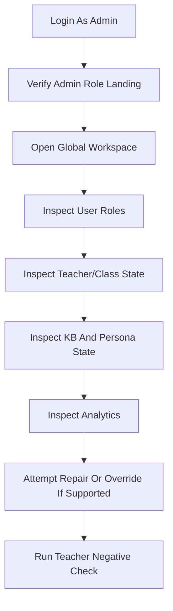

# Admin Workflow Diagram

> Date: 2026-03-27
> Scope: Detailed admin flow inside the single tutor app shell
> Purpose: Show what the admin should start with first, what depends on what, and how the full admin experience should flow in practice

---

## 1. Start Order

Use this order when testing or demonstrating the admin workflow:

1. admin login and role landing
2. global workspace overview
3. user and role inspection
4. class and teacher oversight
5. KB and persona oversight
6. global analytics review
7. override or repair actions
8. negative checks against teacher scope

This order matters because:

- role and workspace validation comes before any elevated inspection
- class and asset oversight are easier after user-role context is clear
- override actions should happen only after inspection confirms the issue
- teacher-negative checks matter only after admin-global scope is defined

---

## 2. High-Level Flow

---

## 3. Detailed Admin Workflow

### Phase A. Admin Identity And Landing

Admin starts here first.

Expected result:

- admin is inside the same app shell as everyone else
- admin can reach elevated role-gated areas
- admin is not limited to teacher-only perspective

What to verify first:

- login succeeds
- role resolves to `admin`
- admin sees elevated workspace options

---

### Phase B. User And Role Inspection

Admin should understand the global actor map before acting.

Admin actions:

1. open user and role inventory
2. confirm role distribution
3. identify candidate users needing promotion, correction, or investigation

Outputs:

- global user-role understanding
- promotion or repair candidates

---

### Phase C. Class And Teacher Oversight

Admin then reviews the operational classroom layer.

Admin actions:

1. inspect a class
2. inspect teacher-managed relationships
3. verify teacher scope is not broken or over-broad

Outputs:

- class oversight state
- relationship health state

---

### Phase D. KB And Persona Oversight

Admin reviews instructional assets next.

Admin actions:

1. inspect KBs
2. inspect class assignments
3. inspect persona defaults or overlays
4. identify orphaned or mis-scoped assets

Outputs:

- asset governance view
- assignment anomaly list

---

### Phase E. Global Analytics

Admin reviews platform-wide signals after inspecting structure.

Admin actions:

1. review platform totals
2. review activity summaries
3. correlate anomalies with user/class/asset state

Outputs:

- global operational summary
- targeted investigation candidates

---

### Phase F. Override And Repair

Admin actions should follow evidence, not precede it.

Admin actions:

1. confirm the issue
2. select the minimal repair action
3. re-check that teacher, student, and parent scopes are still correct

Outputs:

- corrected governance state
- restored boundary integrity

---

## 4. Recommended Real Testing Path

If you want the most realistic admin test sequence, do it in exactly this order:

---

## 5. Quick Decision Rules

When unsure what comes first:

- if login or role resolution fails, stop there first
- if no dedicated admin workspace exists yet, validate current elevated access through shared teacher/admin routes
- if a suspected issue is not visible in data, do not perform repair logic yet
- if teacher can do the same action, it is not an admin-global action

---

## 6. Expected Admin Mental Model

The admin workflow should feel like this:

1. understand global role and relationship state
2. inspect classes and instructional assets
3. identify anomalies or gaps
4. repair only what needs repair
5. preserve teacher, student, and parent ownership boundaries

That is the intended admin flow for both implementation and testing.
