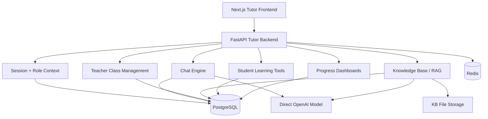
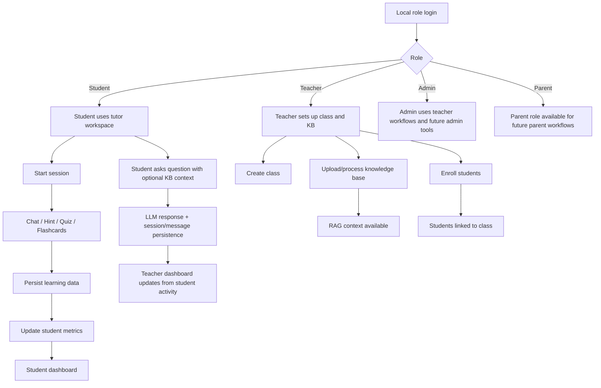
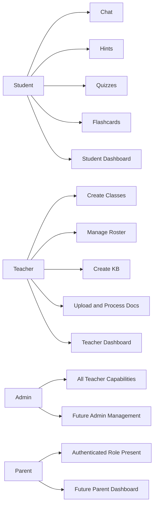
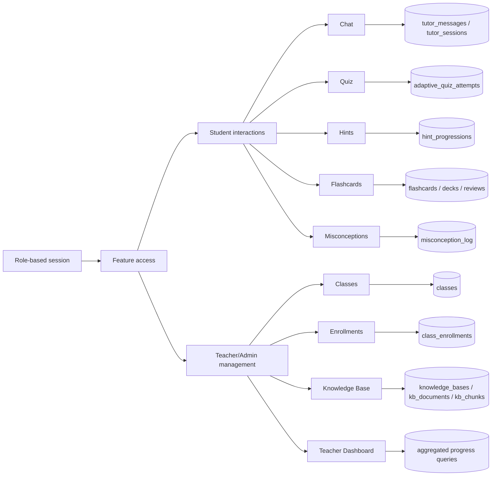
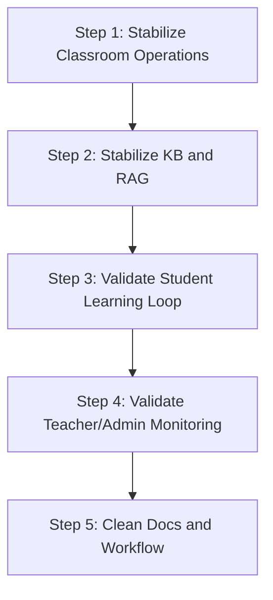
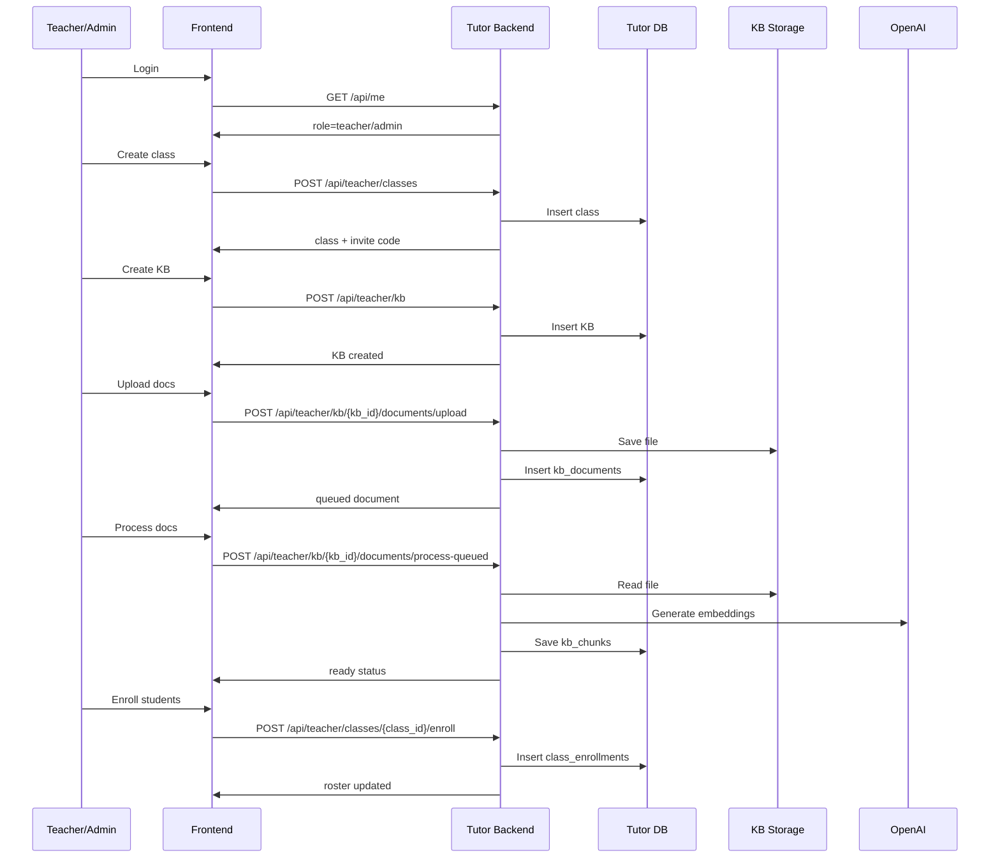
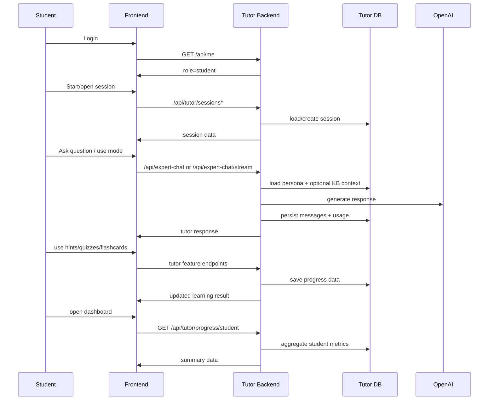
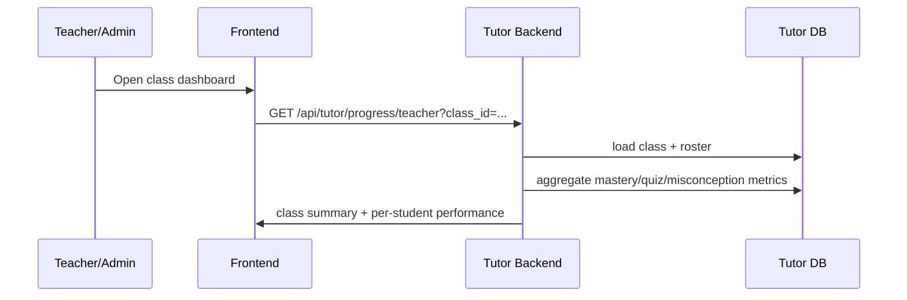

# Local-First Phase 2 Plan: Feature Development on Stable Tutor Foundations

> Status: Planned
> Date: 2026-03-25
> Scope: Local-first tutor development phase defined after decoupling from Laravel/main-site blockers
> Important: This is **not** the same thing as the original "Grand Phase 2: Intelligence Layer". This document describes the temporary local-first execution phase for building the tutor product while the main site is being rebuilt in Python.

---

## 1. Purpose

This phase starts **after** the tutor app can run locally with:

- local role-based login (`student`, `teacher`, `parent`, `admin`)
- direct single-model LLM execution
- no blocking dependency on main-site billing/auth APIs
- stable `/api/me` session contract

The goal of this phase is to build product features normally, using the tutor app as the source of truth for feature behavior, data persistence, and UI workflows.

This phase is where the app becomes genuinely usable for:

- student learning flows
- teacher classroom setup
- teacher/admin knowledge-base workflows
- progress tracking
- future Phase 3 feature expansion

---

## 2. Success Criteria

Phase 2 is complete when all of the following are true:

1. Admin or teacher can fully set up a class without SQL edits.
2. Student can log in, start a session, chat, and have activity persisted.
3. Teacher/admin can create and manage KBs, upload documents, process them, and use them for RAG-backed tutoring.
4. Student activity updates student and teacher dashboards correctly.
5. Role-based UX works consistently in frontend and backend.
6. Remaining development work can continue entirely inside the tutor repo, without waiting for the future Python main-site API.

---

## 3. Phase 2 Architecture



### Architecture Rules for This Phase

- Tutor frontend talks only to tutor backend.
- Tutor backend owns all tutoring logic.
- Role checks happen locally through tutor session + RBAC.
- Tutor DB is the source of truth for classes, sessions, messages, KBs, progress, flashcards, and dashboards.
- External integration concerns must remain adapter-level only.

---

## 4. Chart Pack

This section collects the diagrams for this phase in one place so implementation can follow them directly.

If your markdown preview does not render Mermaid, use the plain-text fallback diagrams in section `4.5`.

### 4.1 High-Level Phase 2 Workflow



### 4.2 Role-to-Capability Map



### 4.3 Internal Data Flow



### 4.4 Implementation Order Diagram



### 4.5 Plain-Text Fallback Diagrams

#### High-Level Phase 2 Workflow

```text
Local role login
  -> Role?
     -> Student
        -> Student uses tutor workspace
        -> Start session
        -> Chat / Hint / Quiz / Flashcards
        -> Persist learning data
        -> Update student metrics
        -> Student dashboard
     -> Teacher
        -> Create class
        -> Upload/process knowledge base
        -> Enroll students
     -> Admin
        -> Use teacher workflows
        -> Future admin tools
     -> Parent
        -> Authenticated role present
        -> Future parent workflows

Knowledge base ready
  -> RAG context available

Student asks question
  -> LLM response + session/message persistence
  -> Teacher dashboard updates from student activity
```

#### Role-to-Capability Map

```text
Student
  - Chat
  - Hints
  - Quizzes
  - Flashcards
  - Student Dashboard

Teacher
  - Create Classes
  - Manage Roster
  - Create KB
  - Upload and Process Docs
  - Teacher Dashboard

Admin
  - All teacher capabilities
  - Future admin management

Parent
  - Authenticated role present
  - Future parent dashboard
```

#### Internal Data Flow

```text
Role-based session
  -> Feature access
     -> Student interactions
        -> Chat -> tutor_messages / tutor_sessions
        -> Quiz -> adaptive_quiz_attempts
        -> Hints -> hint_progressions
        -> Flashcards -> flashcards / decks / reviews
        -> Misconceptions -> misconception_log
     -> Teacher/Admin management
        -> Classes -> classes
        -> Enrollments -> class_enrollments
        -> Knowledge Base -> knowledge_bases / kb_documents / kb_chunks
        -> Teacher Dashboard -> aggregated progress queries
```

#### Implementation Order

```text
Step 1: Stabilize Classroom Operations
  -> Step 2: Stabilize KB and RAG
     -> Step 3: Validate Student Learning Loop
        -> Step 4: Validate Teacher/Admin Monitoring
           -> Step 5: Clean Docs and Workflow
```

---

## 5. Primary User Workflows

### 5.1 Teacher/Admin Setup Workflow



### 5.2 Student Learning Workflow



### 5.3 Teacher Monitoring Workflow



---

## 6. Workstreams

This phase should be implemented through five workstreams.

### Workstream A: Classroom Operations

Objective:
- Make teacher/admin setup operationally usable without DB edits.

Required capabilities:
- class creation
- class listing
- class detail / roster view
- student enrollment
- enrollment removal
- eventually invite-code-based student join flow

Implementation tasks:
1. Verify class create/list/detail/enroll/remove routes are stable.
2. Remove manual friction in the current roster workflow.
3. Add student join path by `invite_code` if manual `student_id` entry is too costly.
4. Ensure teacher/admin UX clearly exposes next setup steps after class creation.

Acceptance criteria:
- teacher/admin can create a class and see it immediately
- teacher/admin can add students without SQL
- class roster reflects enroll/remove actions correctly

### Workstream B: Knowledge Base and RAG

Objective:
- Make teacher-created instructional content actually usable in tutoring.

Required capabilities:
- create KB
- upload documents
- process queued docs
- preview docs
- delete docs
- retrieve relevant chunks
- use KB context during tutor chat

Implementation tasks:
1. Verify document ingestion and chunk persistence.
2. Verify retrieval quality with realistic class materials.
3. Ensure frontend communicates queued, processing, ready, and error states.
4. Ensure RAG citations are visible and stable in chat output.

Acceptance criteria:
- teacher/admin can build a KB from uploaded files
- processed docs produce retrievable chunks
- student or teacher queries can use KB-backed tutoring context

### Workstream C: Student Learning Loop

Objective:
- Ensure the core student loop is complete and reliable.

Required capabilities:
- start/open session
- choose persona
- choose mode
- send/stream chat
- save message history
- use hints/quizzes/flashcards
- see student progress

Implementation tasks:
1. Verify session lifecycle is stable.
2. Verify chat persistence on standard and streaming paths.
3. Verify educational modes store the right data in progress tables.
4. Verify a student can complete a meaningful learning journey in one sitting.

Acceptance criteria:
- student can learn end-to-end without backend errors
- data is persisted and later visible in history/dashboard panels

### Workstream D: Teacher/Admin Visibility

Objective:
- Give teacher/admin enough visibility to manage student learning.

Required capabilities:
- view roster
- view class-level progress dashboard
- see per-student summaries
- correlate class setup with student activity

Implementation tasks:
1. Verify teacher dashboard aggregates are accurate.
2. Ensure selected class drives all dashboard views consistently.
3. Verify empty-state behavior for new classes with no students or no activity.
4. Make sure teacher/admin sees useful setup guidance when data is incomplete.

Acceptance criteria:
- teacher/admin can answer:
  - who is enrolled
  - who is active
  - who is struggling
  - whether KB-backed tutoring is being used

### Workstream E: Tutor-Only Developer Experience

Objective:
- Make the tutor repo independently productive for daily development.

Required capabilities:
- stable seeded role accounts
- no mandatory external auth/billing dependencies
- reproducible local startup
- clear operational docs

Implementation tasks:
1. Keep local auth mode stable.
2. Keep direct single-model configuration stable.
3. Document startup, seeded accounts, and expected local workflows.
4. Ensure app remains swappable back to external integration mode later.

Acceptance criteria:
- a developer can clone, seed, run, log in, and test all roles from this repo alone

---

## 7. Ordered Implementation Sequence

This is the recommended exact order for execution.

### Step 1: Stabilize teacher/admin class setup

Why first:
- teacher workflows are required before the rest of the ecosystem becomes testable.

Tasks:
1. verify current class creation UX
2. verify roster load and error states
3. verify enrollment flow
4. remove manual blockers
5. decide whether invite-code student join must be added immediately

Definition of done:
- teacher/admin can create class and populate roster reliably

### Step 2: Stabilize KB creation and document processing

Why second:
- RAG-backed tutoring is a core differentiator and needs to work before broader feature expansion.

Tasks:
1. create KB
2. upload multiple document types
3. process queued docs
4. inspect preview and error handling
5. validate retrieval quality

Definition of done:
- at least one realistic KB can be built and used successfully in chat

### Step 3: Validate the full student learning loop

Why third:
- once setup is ready, verify the student experience is real and persistent.

Tasks:
1. student login
2. session create/open
3. tutor chat
4. hint workflow
5. quiz workflow
6. flashcards workflow
7. mastery/misconception updates
8. student dashboard verification

Definition of done:
- a student can go from login to learning to dashboard review in one continuous flow

### Step 4: Validate teacher/admin monitoring loop

Why fourth:
- classroom value depends on teacher/admin seeing the output of student activity.

Tasks:
1. open teacher dashboard for a class
2. verify roster-linked student metrics
3. verify empty/new class behavior
4. verify data after multiple student interactions

Definition of done:
- teacher/admin dashboards reflect real student use and class progress

### Step 5: Clean documentation and operational workflow

Why fifth:
- once the feature loop works, lock in the process so implementation can continue efficiently.

Tasks:
1. update user flow docs
2. document setup order for admins/teachers/students
3. document current limitations and temporary workarounds
4. document how this local-first phase maps to the future Python integration

Definition of done:
- implementation team can follow documented setup and continue feature work without rediscovering the system

---

## 8. Recommended Mini-Sprints

### Sprint 2.1: Teacher/Admin Setup Baseline

Deliver:
- class setup stable
- roster management stable
- teacher/admin role usage stable

### Sprint 2.2: KB/RAG Baseline

Deliver:
- upload/process/retrieve stable
- citations stable
- teacher/admin KB workflow usable

### Sprint 2.3: Student Learning Validation

Deliver:
- session/chat/modes stable
- student feature loop stable
- persisted progress visible

### Sprint 2.4: Dashboard Validation

Deliver:
- student dashboard correct
- teacher dashboard correct
- class metrics traceable to activity

### Sprint 2.5: Documentation and Workflow Cleanup

Deliver:
- setup instructions
- phase documentation
- known gaps logged clearly

---

## 9. Known Risks and Workarounds

### Risk 1: teacher/admin setup still depends on manual IDs

Problem:
- current roster flow expects `student_id`, which is operationally awkward.

Workaround:
- short term: expose tutor_user_id visibly in dev mode
- next improvement: add student self-join by invite code

### Risk 2: role-specific flows are incomplete for parent/admin

Problem:
- parent role exists in RBAC but parent product flows are incomplete.

Workaround:
- ensure login/session/RBAC work now
- defer parent-specific feature surface until Phase 3 product work

### Risk 3: local-first phase drifts away from future Python API

Problem:
- too much local-only behavior could increase migration work later.

Workaround:
- preserve stable session payloads and tutor endpoint contracts
- keep auth/billing/model integration isolated behind adapters

### Risk 4: feature work proceeds before operational setup is smooth

Problem:
- advanced development becomes hard to test if classes/KB/roster are still clumsy.

Workaround:
- do not expand deeply until Workstreams A and B are stable

---

## 10. Acceptance Checklist

Use this list before declaring Phase 2 operationally ready.

- [ ] admin login works locally
- [ ] teacher login works locally
- [ ] student login works locally
- [ ] parent login works locally
- [ ] role-based frontend gating works
- [ ] role-based backend gating works
- [ ] teacher/admin can create class
- [ ] teacher/admin can see roster
- [ ] students can be enrolled without SQL edits
- [ ] teacher/admin can create KB
- [ ] documents upload and process successfully
- [ ] retrieval returns useful chunks
- [ ] student can chat with tutor
- [ ] student session history persists
- [ ] student can use hints/quizzes/flashcards
- [ ] student dashboard shows real activity
- [ ] teacher dashboard shows class activity
- [ ] local-first docs are updated

---

## 11. Recommended Notes Before Implementation

1. Treat this phase as the operational foundation for everything that follows.
2. If a workflow still needs SQL or hidden internal knowledge, it is not done.
3. Build the tutor app so feature work can continue even if the future Python main site is delayed.
4. Keep the future integration path clean by preserving endpoint and session contracts.

---

## 12. Immediate Next Action

Start with **Workstream A: Classroom Operations** and **Workstream B: Knowledge Base and RAG** before expanding anything else.

Those two workstreams determine whether the app is genuinely usable for real role-based testing and future implementation speed.
