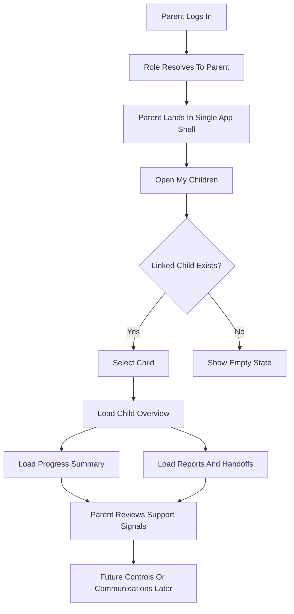
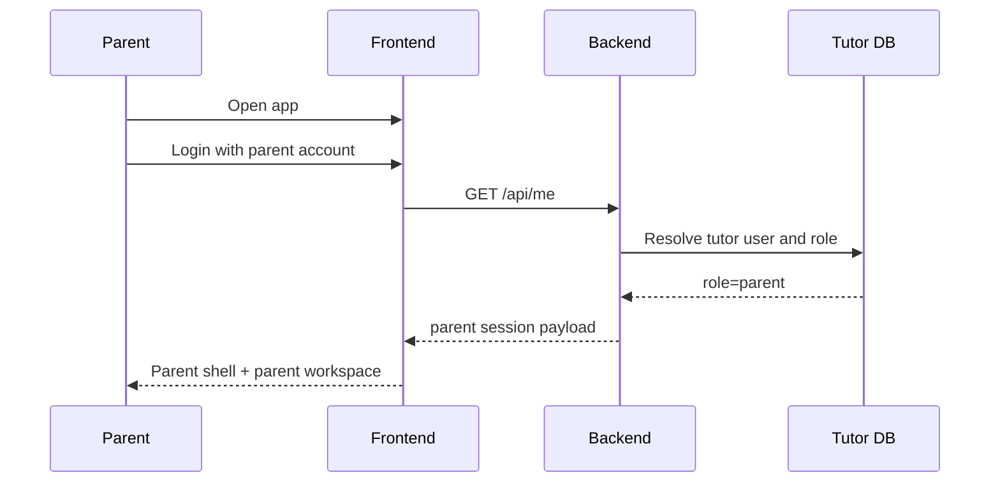
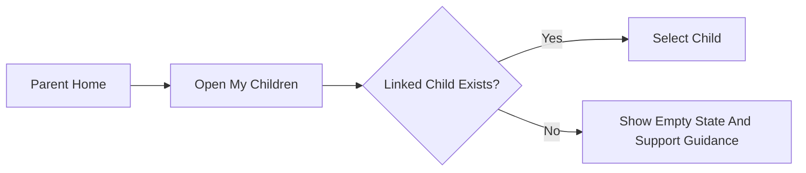
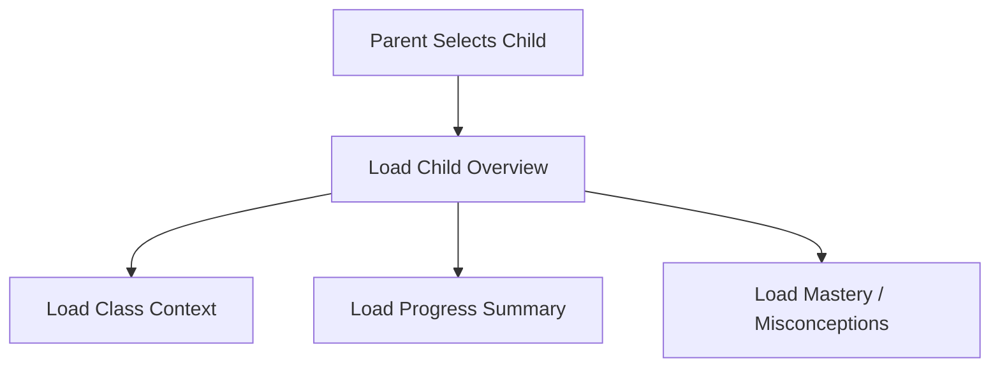
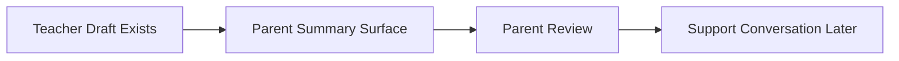
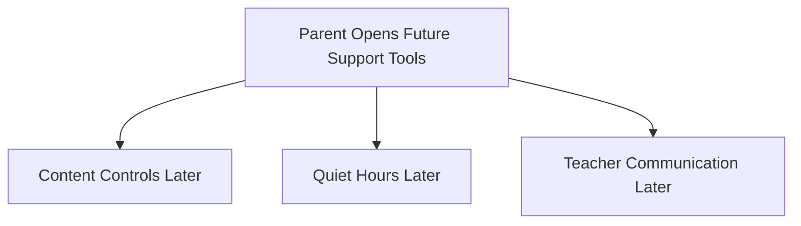
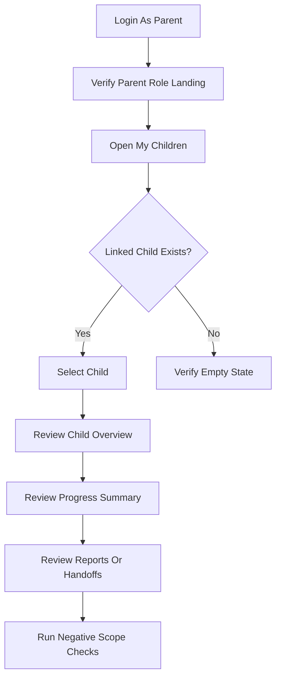

# Parent Workflow Diagram

> Date: 2026-03-27
> Scope: Detailed parent flow inside the single tutor app shell
> Purpose: Show what the parent should start with first, what depends on what, and how the full parent experience should flow in practice

---

## 1. Start Order

Use this order when testing or demonstrating the parent workflow:

1. parent login and role landing
2. linked-child resolution
3. child selection or no-linked-child empty state
4. child overview and progress review
5. report or teacher handoff summary review
6. future controls and communications later
7. negative scope checks

This order matters because:

- parent scope is meaningless before a linked child exists
- progress review should happen only after child context is selected
- communications and controls should be layered after baseline visibility is correct
- negative checks matter because parent must stay non-global and non-teacher

---

## 2. High-Level Flow

---

## 3. Detailed Parent Workflow

### Phase A. Parent Identity And Landing

Parent starts here first.

Expected result:

- parent is inside the same app shell as everyone else
- parent sees parent-scoped workspace
- teacher/admin controls are not the primary workspace

What to verify first:

- login succeeds
- role resolves to `parent`
- parent sees parent-specific shell state when implemented

---

### Phase B. Linked Child Resolution

Parent must resolve child scope before doing anything else.

Why this comes early:

- all parent visibility depends on an explicit link
- progress review is not meaningful before child scope is selected

Parent actions:

1. open `My Children`
2. verify linked child list
3. if no child exists, verify empty-state guidance

Outputs:

- linked-child list
- selected child context or empty-state handling

---

### Phase C. Child Overview And Progress

Once a child is selected, parent reviews support data.

Parent actions:

1. review child overview
2. review current class context
3. review progress, mastery, and misconceptions in parent-readable form

Outputs:

- child overview
- summary-level progress view

---

### Phase D. Reports And Teacher Handoff Summaries

Parent consumes teacher-prepared summaries after child context is known.

Parent actions:

1. open reports or handoff summaries
2. review teacher-facing summary translated for parent use
3. note follow-up actions or communication needs

Outputs:

- parent-readable summary
- support follow-up context

---

### Phase E. Future Controls And Communication

These belong later and must remain linked-child scoped.

Parent actions:

1. inspect future support surfaces only after child visibility works
2. confirm all future actions remain child-linked and non-global

Outputs:

- future controls roadmap
- future communication roadmap

---

## 4. Recommended Real Testing Path

If you want the most realistic parent test sequence, do it in exactly this order:

---

## 5. Quick Decision Rules

When unsure what comes first:

- if login or role resolution fails, stop there first
- if no child is linked, do not test child progress surfaces yet
- if reports do not exist, do not infer teacher handoff behavior from raw teacher analytics
- if parent can see unrelated students or teacher/admin tools, treat that as a boundary failure

---

## 6. Expected Parent Mental Model

The parent workflow should feel like this:

1. understand which child I am linked to
2. review clear summary-level progress
3. understand what support is needed
4. act only within my linked-child support scope

That is the intended parent flow for both implementation and testing.
