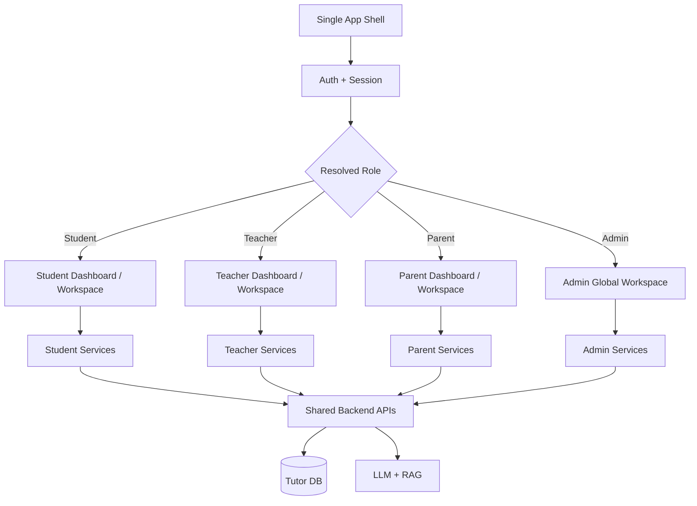
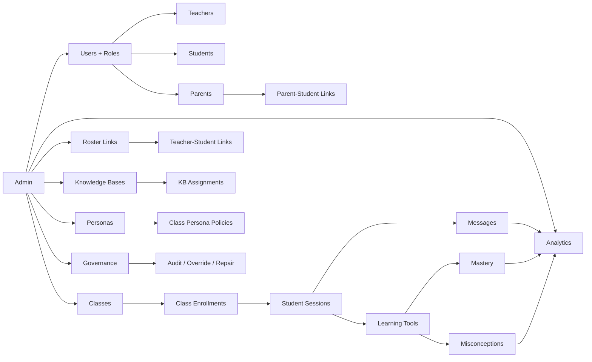
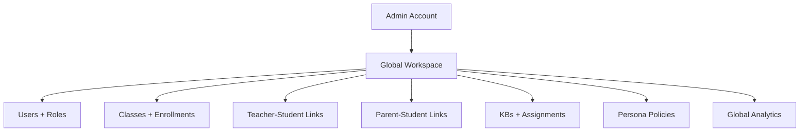
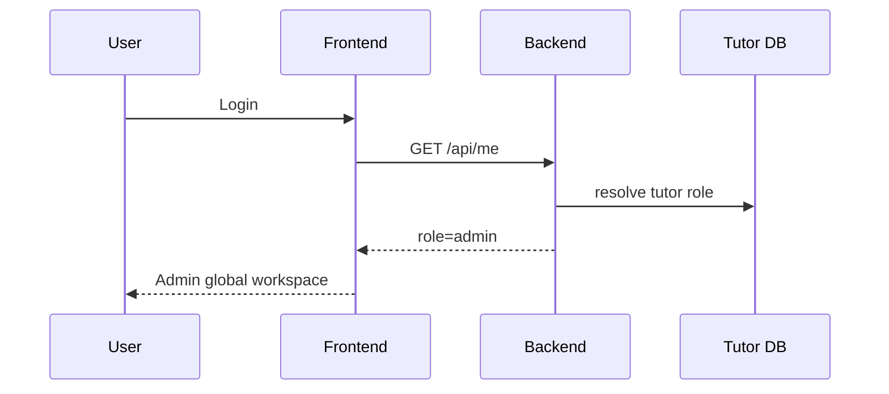
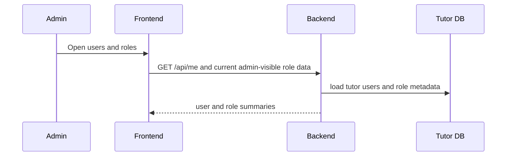
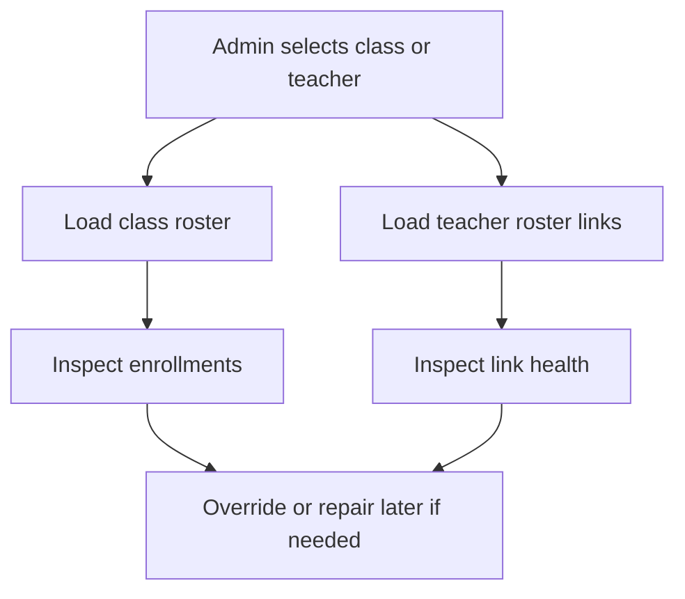
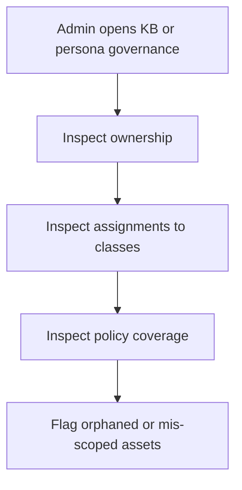
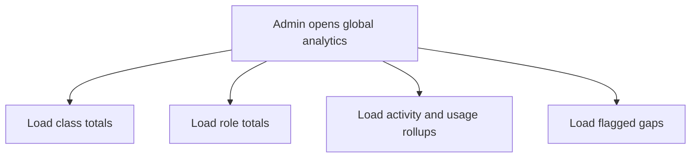
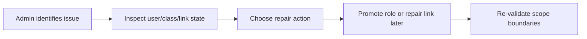

# Phase 2 Admin Section Plan

> Date: 2026-03-27
> Scope: Admin/global-operator experience inside the single tutor app shell
> Architecture rule: No separate admin portal/app. Teacher, student, parent, and admin all live in one RBAC-driven product shell.

---

## 1. Core Principle

The admin section is the global governance and override layer of the tutor ecosystem.

It is responsible for:

- global visibility across roles, classes, and instructional assets
- role governance and relationship repair when local ownership links fail
- oversight of classes, KBs, personas, and analytics across the whole tutor app
- enforcing platform-level boundaries between student, teacher, and parent scopes

It is not responsible for:

- replacing teacher instructional judgment inside a class
- replacing student ownership of learning records
- turning every teacher workflow into an admin-owned daily workflow
- creating a separate global application

---

## 2. Single App Role Architecture

### Role rules

- Admin is the only global role.
- Teacher is limited to explicitly linked students and teacher-owned classes.
- Student is self-scoped.
- Parent is linked-child scoped.

---

## 3. Admin-Centered Ecosystem Architecture

### Runtime meaning

- `Admin workspace` is a global inspection and governance layer, not a second teacher cockpit.
- `Override` means controlled repair or promotion of relationships, not ownership of student records.
- `Global analytics` aggregate across classes and role relationships.

---

## 4. Admin Relationship Model

Use a global-super-role model.

### Admin relationship powers

- inspect any teacher, student, parent, or class relationship
- inspect and repair class enrollments or link tables
- promote or correct role assignments
- review teacher-owned assets such as KBs and persona policies

### Diagram

### Required rules

- admin can inspect all role relationships globally
- admin can override or repair scope relationships when needed
- admin does not erase teacher, student, or parent ownership semantics
- admin actions should be traceable and governance-oriented

---

## 5. Admin Information Architecture

Inside the same app shell, admin navigation should include:

- Admin Home
- Users and Roles
- Teachers
- Students
- Parents
- Classes
- Knowledge Bases
- Personas
- Global Analytics
- Governance / Overrides
- Settings

### Admin Home dashboard should surface

- role counts
- active classes
- teacher/student/parent link health
- KB coverage status
- policy assignment coverage
- activity rollups
- flagged relationship or access anomalies
- quick override actions

---

## 6. Section Workflows

### 6.1 Admin Identity and Landing

Outputs:

- admin-scoped nav
- global overview state

### 6.2 User and Role Oversight

Outputs:

- global role inventory
- candidate promotion or repair targets

### 6.3 Class and Teacher Oversight

Outputs:

- global class oversight
- teacher scope inspection
- relationship repair candidates

### 6.4 Knowledge Bases and Persona Governance

Outputs:

- global asset inventory
- assignment coverage view
- governance anomalies

### 6.5 Global Analytics

Outputs:

- global platform summary
- cross-class operational visibility

### 6.6 Override and Repair

Outputs:

- repaired role or relationship state
- validated boundary restoration

---

## 7. Relationship to Other Roles

The admin section should coordinate with, not replace, the other role packs.

### Boundary rules to preserve

- teacher retains instructional ownership inside their class scope
- student retains ownership of sessions, messages, and learning records
- parent later retains linked-child support scope only
- admin alone can inspect across all three scopes globally

---

## 8. API Surface

Current/near-term route groups:

- `/api/me`
- teacher-accessible route groups currently usable by admin through RBAC:
  - `/api/teacher/classes*`
  - `/api/teacher/kb*`
  - `/api/teacher/roster`
  - `/api/teacher/join-codes`
  - `/api/teacher/join-requests`
  - `/api/teacher/personas`
  - `/api/teacher/analytics/*`
  - `/api/teacher/session-replay/*`
  - `/api/teacher/copilot/*`
  - `/api/teacher/reports`
  - `/api/teacher/communications`
  - `/api/teacher/assessments*`

Planned admin route groups:

- `/api/admin/users`
- `/api/admin/users/{id}/role`
- `/api/admin/classes`
- `/api/admin/teachers`
- `/api/admin/students`
- `/api/admin/parents`
- `/api/admin/links/teacher-student`
- `/api/admin/links/parent-student`
- `/api/admin/kb`
- `/api/admin/personas`
- `/api/admin/analytics/global`
- `/api/admin/governance/audit`
- `/api/admin/governance/repair`

---

## 9. Acceptance Criteria

- admin lands in admin workspace inside same app shell
- admin is the only global role
- admin can inspect across classes, teachers, students, and linked-parent structures
- admin can use elevated visibility without collapsing teacher ownership into admin ownership
- admin can identify and later repair broken role or relationship scope
- teacher cannot perform admin-global actions

---

## 10. Non-Goals For This Phase

- separate admin application
- turning admin into the default day-to-day teacher workflow
- full audit product implementation if routes are not yet built
- school district multi-tenant governance beyond current tutor scope

---

## 11. Implementation Notes

Implemented in repo now:

- admin local-dev role exists and resolves in the same app shell
- admin is allowed through teacher/admin RBAC surfaces already used by teacher workflows
- admin can currently use teacher-capable management flows and teacher analytics routes

Not fully implemented yet in repo:

- dedicated admin global workspace
- dedicated admin route groups for role promotion, relationship repair, or global analytics
- explicit admin governance and audit UI

Testing reference:

- see `tech-docs/phase-2/ADMIN_TESTING_GUIDE.md` for local admin login, elevated-access validation, and negative checks proving teacher cannot perform admin-global actions
