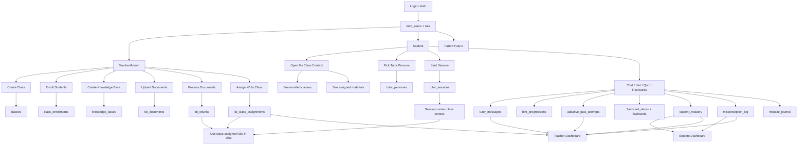
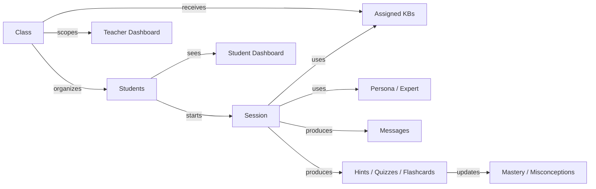
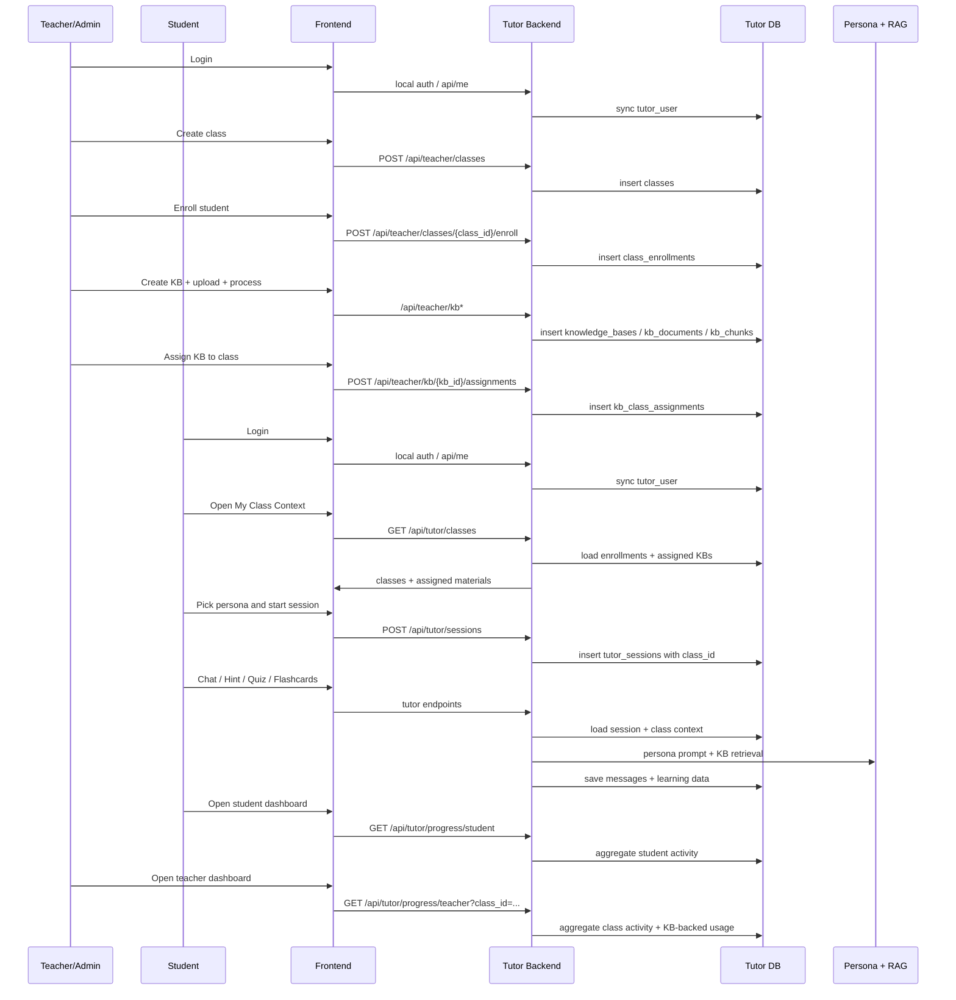

# Phase 2 Ecosystem Mapping

> Date: 2026-03-25
> Purpose: Canonical map for how identity, classroom setup, tutor personas, KB/RAG, student activity, and dashboards link together inside the tutor repo.

---

## Planning References

- Teacher section architecture and workflows: [PHASE_2_TEACHER_SECTION_PLAN.md](./PHASE_2_TEACHER_SECTION_PLAN.md)
- Teacher implementation tracker: [PHASE_2_TEACHER_TRACKER.md](./PHASE_2_TEACHER_TRACKER.md)
- Teacher-only seeded validation flow: [TEACHER_TESTING_GUIDE.md](./TEACHER_TESTING_GUIDE.md)

## 1. Core Principle

Keep these responsibilities separate:

- `role` decides access
- `class` decides grouping and assignment scope
- `persona` decides how the tutor responds
- `knowledge base` decides what source material the tutor can use
- `session` decides which student interaction thread is active
- `dashboard` summarizes activity from the underlying learning tables

If those responsibilities blur together, the system becomes hard to reason about.

---

## 2. Entity Map

| Entity | Owned By | Created By | Used By | Primary Tables / Routes |
|---|---|---|---|---|
| Identity | auth layer | local auth / future main site | all roles | `tutor_users`, `/api/me`, `/api/local-auth/*` |
| Role / RBAC | auth layer | auth sync | routers, frontend gating | `role`, `rbac.py` |
| Class | teacher/admin | teacher/admin | teacher dashboard, student class context, KB assignment | `classes`, `/api/teacher/classes` |
| Enrollment | classroom layer | teacher/admin | student class access, teacher roster | `class_enrollments` |
| Tutor Persona | tutor config layer | seeded/custom teacher/admin | sessions, chat UX | `tutor_personas`, `/api/experts` |
| Session | student | student | chat, hints, quizzes, flashcards | `tutor_sessions`, `/api/tutor/sessions` |
| Messages | student session | chat flow | history, teacher activity metrics | `tutor_messages`, `/api/expert-chat*` |
| Knowledge Base | teacher/admin | teacher/admin | assigned class tutoring | `knowledge_bases`, `/api/teacher/kb` |
| KB Documents | teacher/admin | teacher/admin | retrieval pipeline | `kb_documents` |
| KB Chunks | KB pipeline | document processing | RAG retrieval | `kb_chunks` |
| KB Assignment | classroom + KB bridge | teacher/admin | student class materials, chat retrieval | `kb_class_assignments`, `/api/teacher/kb/{kb_id}/assignments` |
| Hint Progression | student | student | hint workflow | `hint_progressions` |
| Quiz Attempt | student | student | quiz workflow, mastery | `adaptive_quiz_attempts` |
| Flashcards | student | student | revision workflow | `flashcard_decks`, `flashcards` |
| Mastery | derived learning state | quiz/mastery logic | student + teacher dashboards | `student_mastery` |
| Misconceptions | derived learning state | quiz explanation flow | student + teacher dashboards | `misconception_log` |
| Student Dashboard | reporting layer | derived | student | `/api/tutor/progress/student` |
| Teacher Dashboard | reporting layer | derived | teacher/admin | `/api/tutor/progress/teacher` |

---

## 3. Relationship Diagram

```text
tutor_users
  -> one role per actor

teacher/admin
  -> owns classes
  -> owns knowledge_bases

classes
  -> has many class_enrollments
  -> has many assigned knowledge_bases through kb_class_assignments

student
  -> belongs to classes through class_enrollments
  -> has many tutor_sessions
  -> has many learning records

tutor_sessions
  -> belongs to one student
  -> uses one tutor_persona
  -> may belong to one class context

tutor_messages
  -> belongs to one session
  -> may reference one KB used during chat

knowledge_bases
  -> owned by teacher/admin
  -> has many documents
  -> has many chunks
  -> assigned to classes
```

### Visual Ecosystem Diagram



### Runtime Meaning Diagram



---

## 4. Who Creates What

### Teacher/Admin creates

- class
- class roster
- KB
- KB documents
- KB processing
- KB-to-class assignment

### Student creates

- session
- messages
- hint progressions
- quiz attempts
- flashcard decks and cards
- derived mastery and misconception signals

### Teacher/Admin reads

- class roster
- assigned class materials
- class-level activity summary
- student-level progress summary

---

## 5. End-to-End Operational Flow

### Step 1: Identity

- user logs in
- user is synced to `tutor_users`
- role is resolved locally

### Step 2: Classroom Setup

- teacher creates class
- teacher enrolls student
- teacher creates KB
- teacher uploads and processes docs
- teacher assigns KB to class

### Step 3: Student Context

- student opens tutor app
- student sees `My Class Context`
- student sees enrolled classes
- student sees assigned materials for selected class

### Step 4: Session Start

- student chooses tutor persona
- student starts session with selected class context
- session persists `class_id`

### Step 5: Learning Loop

- student chats / requests hints / runs quiz / generates flashcards
- chat can use assigned KB context from class
- message history persists
- KB-backed messages persist KB usage

### Step 6: Reporting

- student dashboard reads student-owned activity
- teacher dashboard reads class-scoped student activity
- teacher can see active students, session/message volume, and KB-backed activity

### Sequence Workflow



### Plain Text Workflow

```text
Teacher/Admin
  -> login
  -> create class
  -> enroll student
  -> create KB
  -> upload docs
  -> process docs into chunks
  -> assign KB to class

Student
  -> login
  -> open My Class Context
  -> select class
  -> see assigned materials
  -> pick tutor persona
  -> start session
  -> chat / hint / quiz / flashcards
  -> generate mastery / misconception data
  -> view student dashboard

Teacher/Admin
  -> open class dashboard
  -> see roster
  -> see active students
  -> see message/session counts
  -> see KB-backed usage
  -> see mastery / quiz / misconception trends
```

---

## 6. Canonical Runtime Meaning

### Class

Class is not the owner of student learning records.

Class is the scope for:

- roster
- assigned materials
- session context
- teacher dashboard aggregation

### Persona / Expert

Persona is not a classroom teacher.

Persona is the tutor identity that controls:

- explanation style
- teaching tone
- pedagogical framing
- subject emphasis

### Knowledge Base

KB is not a class by itself.

KB is a teacher-owned content set that becomes useful to students only after assignment or explicit access.

---

## 7. What Frontend Should Communicate Clearly

Student should understand:

- which class is currently active
- which materials are assigned to that class
- which tutor persona is active
- whether tutor output is grounded in KB sources

Teacher should understand:

- which class is selected
- which students are enrolled
- which KBs are assigned to that class
- which student activity came from classroom usage

---

## 8. Required Invariants

These rules should remain true:

1. Every learning record belongs to a student.
2. Every teacher dashboard view is scoped by class.
3. Every class-assigned KB is visible from the classroom context.
4. Every session may carry class context.
5. Every KB-backed chat can be reported as KB-backed usage.
6. Personas remain separate from classes and KBs.

---

## 9. Current Implemented Ecosystem Links

- local role login and tutor user sync
- teacher class CRUD + enrollment
- KB CRUD + processing
- KB-to-class assignment routes
- student class listing with assigned materials
- class-aware session creation
- class-aware KB retrieval during chat
- citation display in tutor workspace
- expanded teacher dashboard activity metrics

Teacher planning follow-up:

- use [PHASE_2_TEACHER_SECTION_PLAN.md](./PHASE_2_TEACHER_SECTION_PLAN.md) for the granular teacher workflows, role-scope model, and student-profile handoff points
- use [PHASE_2_TEACHER_TRACKER.md](./PHASE_2_TEACHER_TRACKER.md) for execution order, status, and validation requirements

---

## 10. Remaining Non-Goals For This Phase

These may still be deferred:

- parent-specific UX
- student self-join by invite code
- class-scoped assignments/homework products
- parent dashboard
- advanced teacher analytics beyond current class metrics
