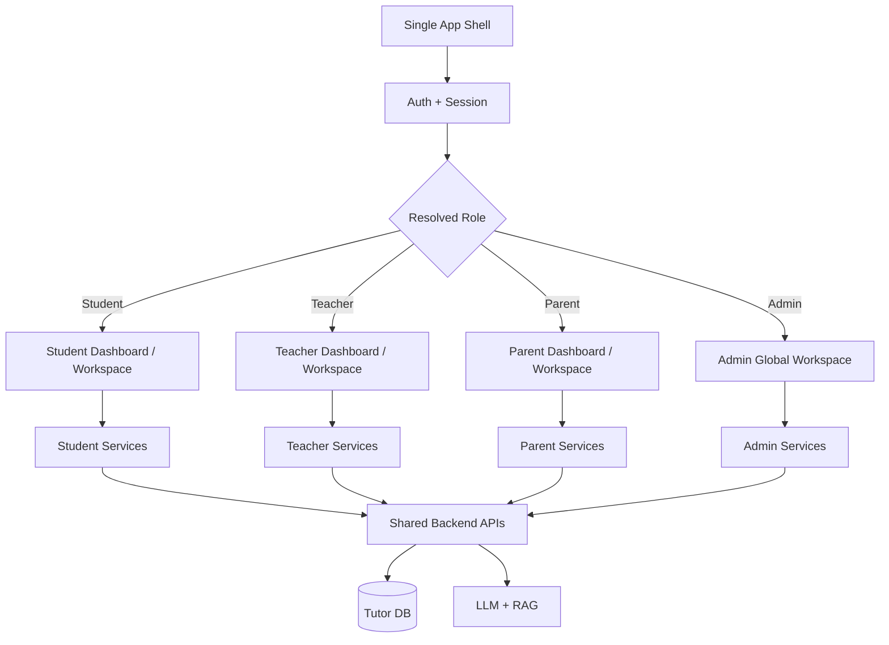
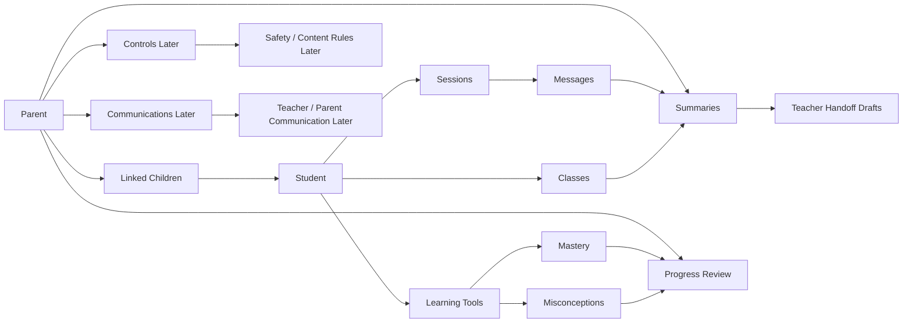
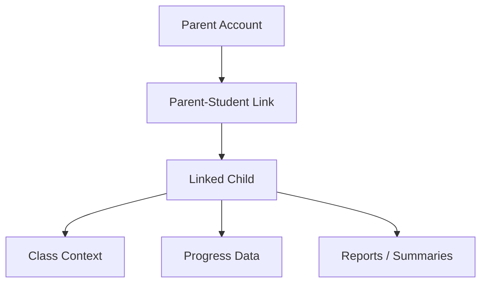
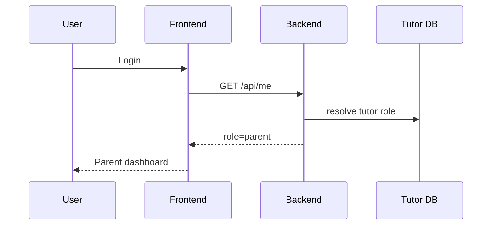
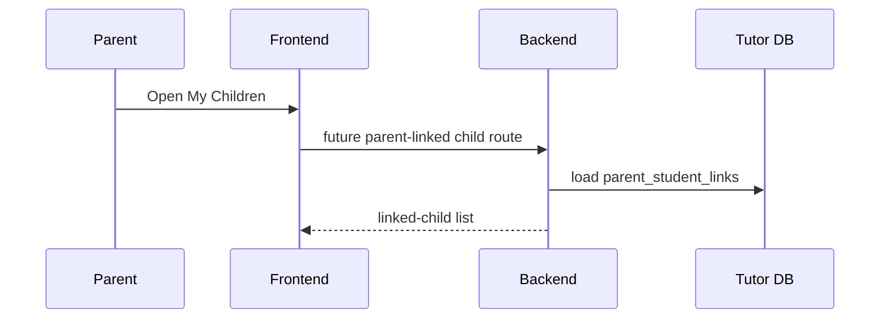
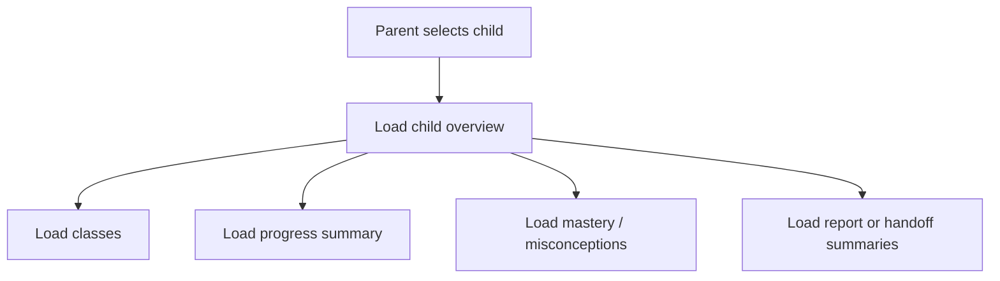
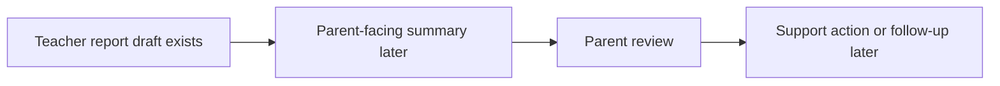
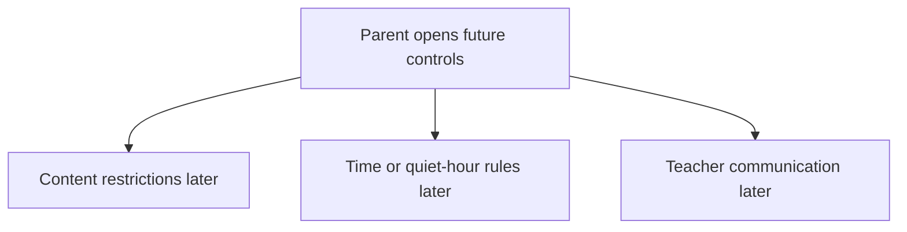

# Phase 2 Parent Section Plan

> Date: 2026-03-27
> Scope: Parent/guardian experience inside the single tutor app shell
> Architecture rule: No separate parent portal/app. Teacher, student, parent, and admin all live in one RBAC-driven product shell.

---

## 1. Core Principle

The parent section is the linked-child oversight and support layer of the tutor ecosystem.

It is responsible for:

- viewing linked-child progress and summaries
- consuming parent-facing reports and teacher handoff summaries
- reviewing child learning status without becoming classroom owner
- enforcing future child-linked safety and support controls

It is not responsible for:

- creating classes or managing teacher rosters
- owning student learning records
- browsing unrelated students
- replacing teacher instructional workflows or admin global governance

---

## 2. Single App Role Architecture

### Role rules

- Parent sees only explicitly linked children.
- Student remains self-scoped and owns their learning records.
- Teacher sees only linked or enrolled students they manage.
- Admin can inspect everything globally as a super-role.

---

## 3. Parent-Centered Ecosystem Architecture

### Runtime meaning

- `Linked children` is the parent scope boundary.
- `Parent review` is read-heavy and support-oriented.
- `Controls` and `communication` are future-facing but must remain linked-child scoped.

---

## 4. Parent-Child Link Model

Use an explicit link model.

### Parent-level link

- parent account exists
- system resolves parent role
- parent can view only children explicitly linked through `parent_student_links`

### Diagram

### Required rules

- parent cannot see a child without an explicit link
- parent sees linked-child progress but not teacher-global analytics
- parent does not own or mutate student learning records
- admin can inspect and repair parent-child links globally if needed

---

## 5. Parent Information Architecture

Inside the same app shell, parent navigation should include:

- Parent Home
- My Children
- Child Overview
- Progress
- Reports and Summaries
- Support Guidance
- Controls Later
- Communications Later
- Settings

### Parent Home dashboard should surface

- linked children
- child progress snapshots
- recent activity summaries
- teacher handoff summaries when available
- support prompts for next review actions
- future content or schedule controls

---

## 6. Section Workflows

### 6.1 Parent Identity and Landing

Outputs:

- parent-scoped nav
- parent role state

### 6.2 Linked Child Resolution

Outputs:

- linked-child list
- empty state when no child is linked

### 6.3 Child Overview and Progress

Outputs:

- child overview
- progress summary
- parent-readable supporting summaries

### 6.4 Reports and Teacher Handoff Consumption

Outputs:

- parent-readable summary object
- teacher-to-parent handoff surface

### 6.5 Future Controls and Communication

Outputs:

- future linked-child controls
- future parent support communication surfaces

---

## 7. Boundary Mapping to Student, Teacher, and Admin

The parent section should consume other role outputs without collapsing their ownership rules.

### Boundary rules to preserve

- student remains owner of sessions, messages, and learning records
- teacher remains the classroom owner and monitoring reader for linked or enrolled students
- parent remains linked-child support and summary reader
- admin remains the only global role

---

## 8. API Surface

Current/near-term route groups:

- `/api/me`
- parent role resolution and shell gating exist
- parent-specific dedicated route groups are still largely scaffolded

Planned parent route groups:

- `/api/parent/children`
- `/api/parent/children/{id}/overview`
- `/api/parent/children/{id}/progress`
- `/api/parent/children/{id}/reports`
- `/api/parent/controls`
- `/api/parent/communications`
- `/api/parent/co-learning`

---

## 9. Acceptance Criteria

- parent lands in parent dashboard inside same app shell
- parent sees only explicitly linked children
- parent can consume linked-child summaries without browsing unrelated students
- teacher handoff summaries can later surface in a parent-readable way
- parent does not gain teacher classroom-owner tools or admin-global visibility

---

## 10. Non-Goals For This Phase

- separate parent application
- full Phase 3 parent dashboard implementation
- co-learning runtime execution
- teacher-gradebook ownership by parent
- admin-global analytics exposure to parents

---

## 11. Implementation Notes

Implemented in repo now:

- parent local-dev role exists and resolves inside the same app shell
- parent remains part of the valid tutor RBAC role set
- teacher reporting surfaces already include parent handoff summary concepts in draft form

Not fully implemented yet in repo:

- dedicated parent routes
- linked-child parent dashboard
- parent progress views
- parent communications and controls

Testing reference:

- see `tech-docs/phase-2/PARENT_TESTING_GUIDE.md` for local parent login, required link assumptions, and parent boundary validation order
