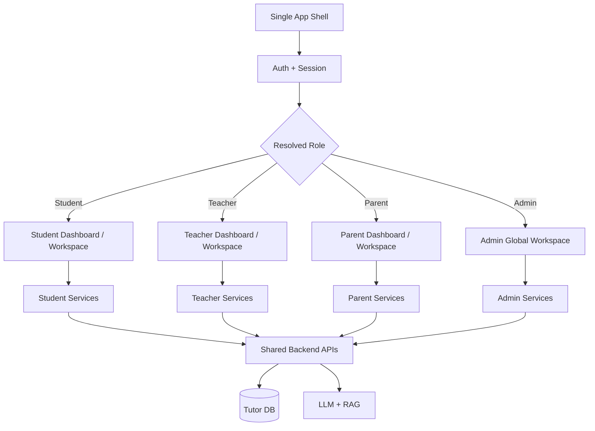
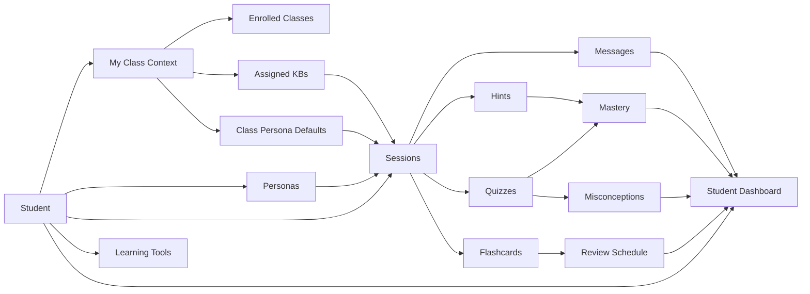
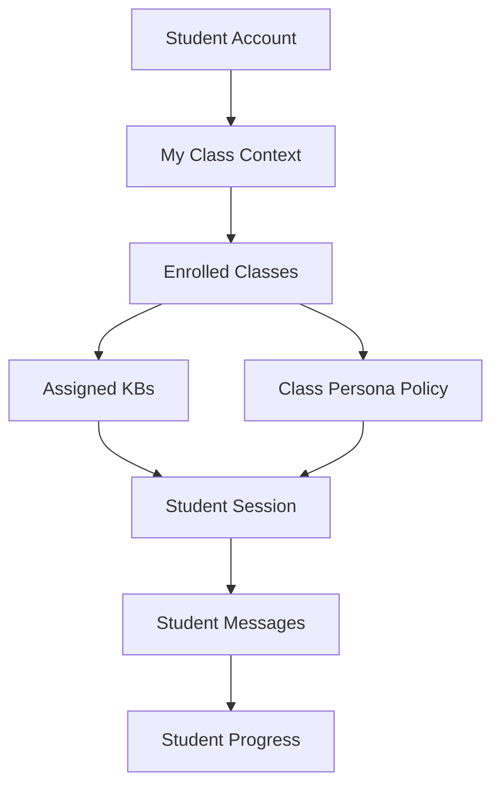
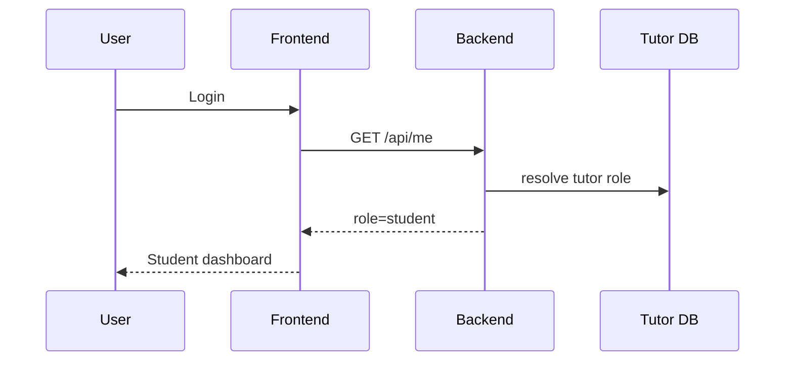
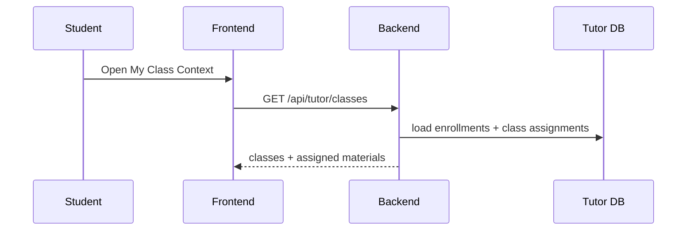
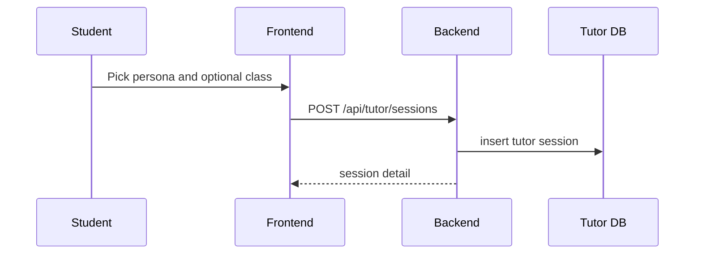
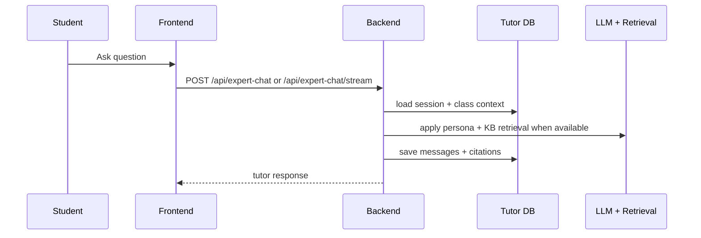
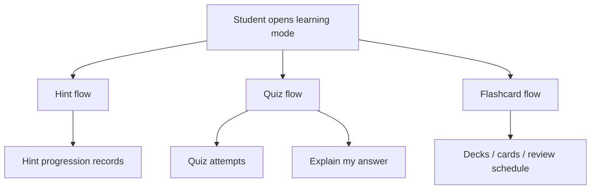
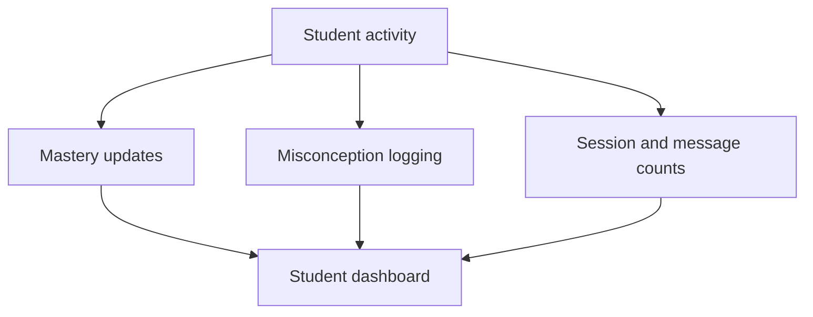
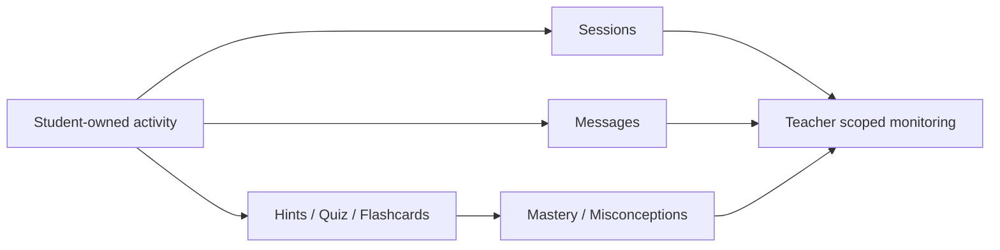

# Phase 2 Student Section Plan

> Date: 2026-03-27
> Scope: Student/learner experience inside the single tutor app shell
> Architecture rule: No separate student portal/app. Teacher, student, parent, and admin all live in one RBAC-driven product shell.

---

## 1. Core Principle

The student section is the learner-owned activity layer of the tutor ecosystem.

It is responsible for:

- owning tutoring sessions and message history
- consuming assigned class context, materials, and tutor defaults
- running learning tools such as hints, quizzes, flashcards, and mastery review
- surfacing student self-view progress and misconceptions

It is not responsible for:

- creating classes or teacher roster links
- globally browsing other students
- overriding class policy or assigned KBs
- replacing teacher, parent, or admin oversight surfaces

---

## 2. Single App Role Architecture

### Role rules

- Student sees only their own profile, classes, sessions, and learning data.
- Teacher sees only explicitly linked students and class enrollments they manage.
- Parent sees only explicitly linked children later.
- Admin can see everything globally as a super-role.

---

## 3. Student-Centered Ecosystem Architecture

### Runtime meaning

- `My Class Context` is the student view of enrollment, assigned KBs, and class defaults.
- `Session` is student-owned and may carry class context chosen by the student.
- `Learning tools` write student-owned progress signals.
- `Student dashboard` is self-view, not teacher or admin analytics.

---

## 4. Student Class-Context Model

Use a student self-context model.

### Student context inputs

- student logs in with local role resolution
- system loads enrolled classes
- system loads class-assigned KBs
- system loads any class-level persona policy defaults

### Student context behavior

- student can view assigned materials for the selected class
- student can start a session with or without class context when allowed by UI
- student-owned activity persists regardless of teacher visibility
- teacher-created class settings influence tutoring behavior but do not transfer ownership

### Diagram

### Required rules

- student cannot see other students from the database
- student can see only classes they are enrolled in
- class context can enrich tutoring, but all resulting records remain student-owned
- teacher monitoring is a scoped read-view over student-owned activity, not shared ownership

---

## 5. Student Information Architecture

Inside the same app shell, student navigation should include:

- Student Home
- My Class Context
- Tutor Workspace
- Session History
- Hints
- Quiz Me
- Flashcards
- Mastery
- Misconceptions
- Progress Dashboard
- Settings

### Student Home dashboard should surface

- active class
- assigned materials
- recent sessions
- current tutor persona or class default
- mastery highlights
- misconception review queue
- flashcard review due items
- quick resume actions

---

## 6. Section Workflows

### 6.1 Student Identity and Landing

Outputs:

- student-scoped nav
- student self-view state

### 6.2 My Class Context

Outputs:

- enrolled class list
- assigned KB/material state
- active class context

### 6.3 Session Start and Persona Selection

Outputs:

- student-owned session
- selected persona
- optional class-aware session context

### 6.4 Tutor Chat and KB-Backed Learning

Outputs:

- persisted messages
- class-aware KB usage
- citation-backed tutor response

### 6.5 Hints, Quizzes, and Flashcards

Outputs:

- hint progression state
- adaptive quiz attempts
- mistake journal entries
- spaced repetition review records

### 6.6 Mastery, Misconceptions, and Dashboard

Outputs:

- student summary metrics
- mastery visibility
- misconception review list

### 6.7 Student-to-Teacher Handoff Boundary

Outputs:

- student self-view remains canonical
- teacher sees scoped read-only summaries for linked or enrolled students

---

## 7. Mapping to Teacher and Parent Views

The student section should expose downstream interfaces that teacher and parent views later consume.

### Downstream dependencies

- enrolled classes
- assigned KBs
- class persona defaults
- session history
- mastery summaries
- misconception summaries
- report-friendly progress signals

### Student ownership rules to preserve

- student profile is self-view of student-owned activity
- teacher dashboard is scoped read-view of linked or enrolled students
- parent dashboard later is linked-child read-view only
- admin can inspect globally without changing student ownership semantics

---

## 8. API Surface

Current/near-term route groups:

- `/api/tutor/classes`
- `/api/tutor/classes/join`
- `/api/tutor/sessions*`
- `/api/expert-chat`
- `/api/expert-chat/stream`
- `/api/tutor/hints*`
- `/api/tutor/quiz*`
- `/api/tutor/flashcards*`
- `/api/tutor/mastery`
- `/api/tutor/misconceptions`
- `/api/tutor/progress/student`
- `/api/experts`
- `/api/tutor/modes`

Planned student route groups:

- `/api/student/home`
- `/api/student/class-context`
- `/api/student/recommendations`
- `/api/student/progress/history`
- `/api/student/review-queue`

---

## 9. Acceptance Criteria

- student lands in student dashboard inside same app shell
- student can access only self-scoped data and class context
- student can view assigned class materials and tutor defaults
- student can create sessions, chat, and persist message history
- student can use hints, quizzes, flashcards, mastery, and misconception tools
- teacher monitoring can consume student-owned outputs without changing student ownership

---

## 10. Non-Goals For This Phase

- separate student application
- peer-to-peer student visibility
- parent co-learning execution
- marketplace or social layer
- school-wide analytics beyond teacher/admin scope separation

---

## 11. Implementation Notes

Implemented in repo now:

- student role landing inside the same app shell
- `/api/tutor/classes` student class context
- `/api/tutor/classes/join` for class self-join with teacher auto-link
- `/api/tutor/sessions*`, `/api/expert-chat`, `/api/expert-chat/stream`
- `/api/tutor/hints*`, `/api/tutor/quiz*`, `/api/tutor/flashcards*`
- `/api/tutor/mastery`, `/api/tutor/misconceptions`, `/api/tutor/progress/student`
- frontend student tutoring workspace, session history, and dashboard panels

Testing reference:

- see `tech-docs/phase-2/STUDENT_TESTING_GUIDE.md` for local accounts, validation order, and student-only scope checks
