# Phase 2 Teacher Section Plan

> Date: 2026-03-26
> Scope: Teacher/educator experience inside the single tutor app shell
> Architecture rule: No separate teacher portal/app. Teacher, student, parent, and admin all live in one RBAC-driven product shell.

---

## 1. Core Principle

The teacher section is the instructional control layer of the tutor ecosystem.

It is responsible for:

- linking students to teachers
- organizing students into classes
- assigning instructional materials and tutor behavior
- monitoring learning activity
- preparing intervention and communication outputs

It is not responsible for:

- owning student learning records
- exposing all student users in the database
- replacing admin/global visibility
- creating a separate teacher app

---

## 2. Single App Role Architecture

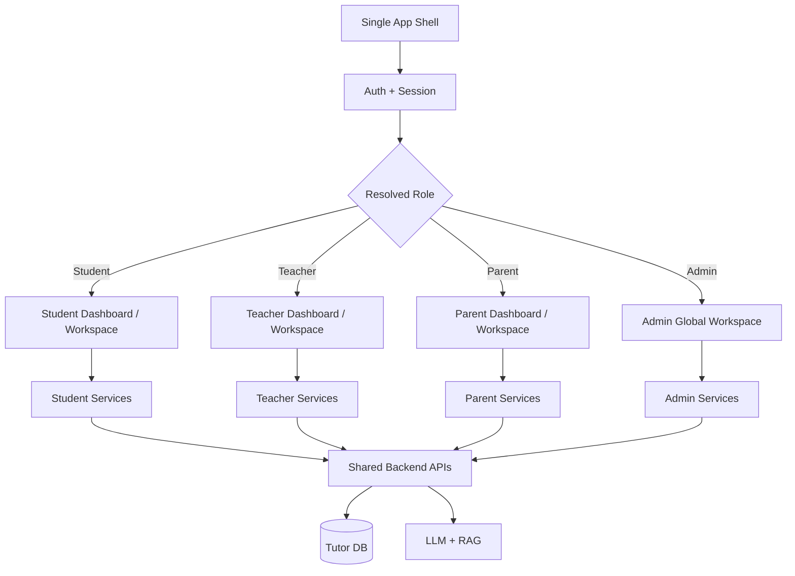

### Role rules

- Teacher sees only explicitly joined students and class enrollments they manage.
- Student sees only their own profile, class context, and learning data.
- Parent later sees only linked children.
- Admin can see everything globally as a super-role.

---

## 3. Teacher-Centered Ecosystem Architecture

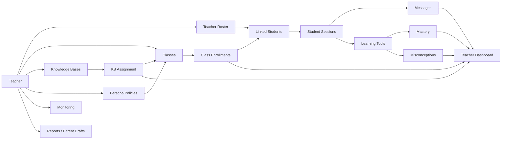

### Runtime meaning

- `Teacher roster` is the relationship layer between teacher and student.
- `Class` is the academic grouping layer.
- `KB assignment` and `persona policy` are class-scoped instructional configuration.
- `Monitoring` is teacher-scoped read access over student-owned learning records.

---

## 4. Join and Handshake Model

Use a hybrid join model.

### Teacher-level join

- teacher creates invite code/link
- student or parent submits join request
- teacher approves request
- student is added to teacher roster even before class placement

### Class-level join

- teacher creates class invite code
- student joins the class
- system also creates/ensures teacher-student link

### Diagram

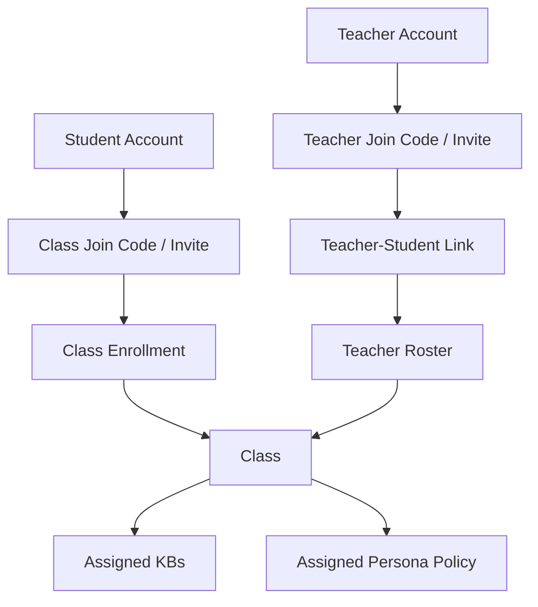

### Required rules

- teacher cannot see student without an approved link
- teacher can have linked students not yet assigned to classes
- class join should auto-create missing teacher link
- admin can inspect and override globally if needed

---

## 5. Teacher Information Architecture

Inside the same app shell, teacher navigation should include:

- Teacher Home
- My Roster
- Classes
- Knowledge Bases
- Personas
- Monitoring
- Session Replay
- Assessments
- Co-Pilot
- Reports
- Settings

### Teacher Home dashboard should surface

- active classes
- linked students
- unassigned students
- pending join requests
- recent activity
- struggling/inactive students
- KB assignment status
- quick actions

---

## 6. Section Workflows

### 6.1 Teacher Identity and Landing

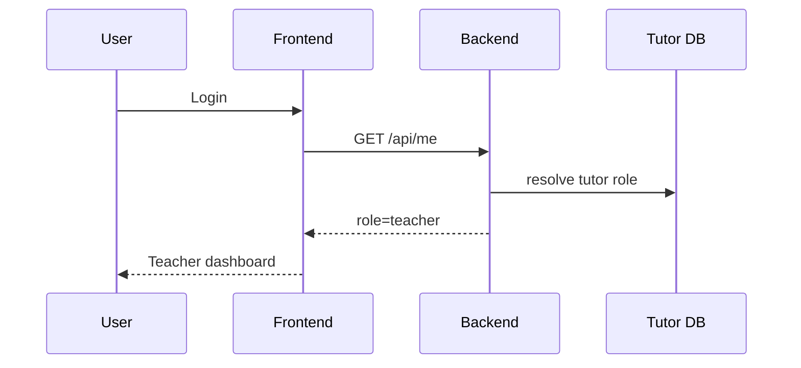

Outputs:

- teacher-scoped nav
- teacher dashboard state

### 6.2 Teacher Roster

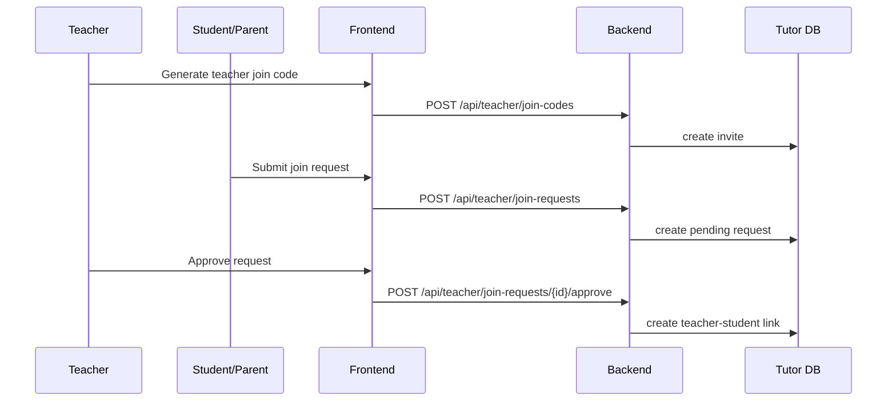

Outputs:

- teacher roster link
- join request history

### 6.3 Class Management

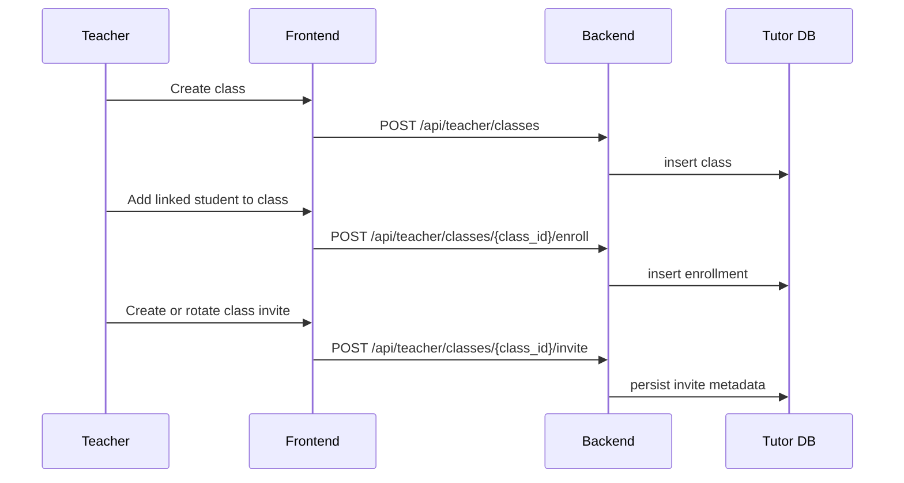

Outputs:

- class
- class roster
- class invite

### 6.4 Knowledge Bases

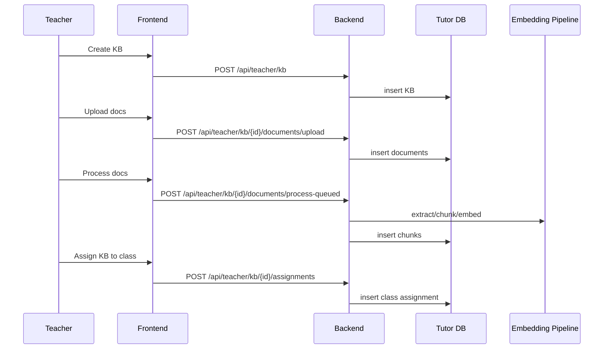

Outputs:

- KB
- KB documents
- KB chunks
- KB assignments

### 6.5 Personas

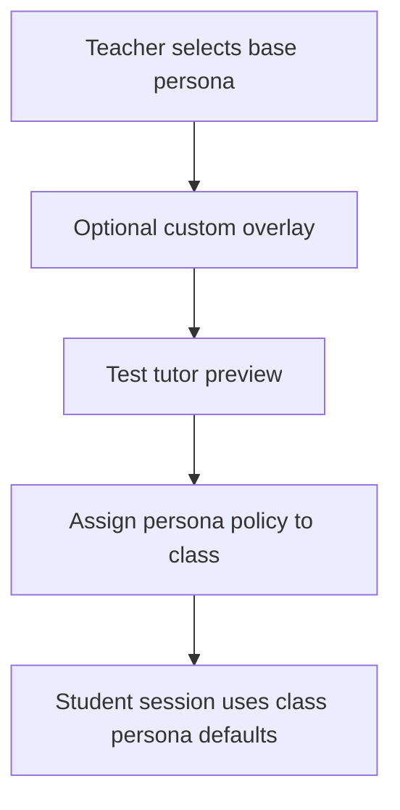

Outputs:

- class tutor behavior policy
- future teacher-custom persona overlay

### 6.6 Monitoring and Session Replay

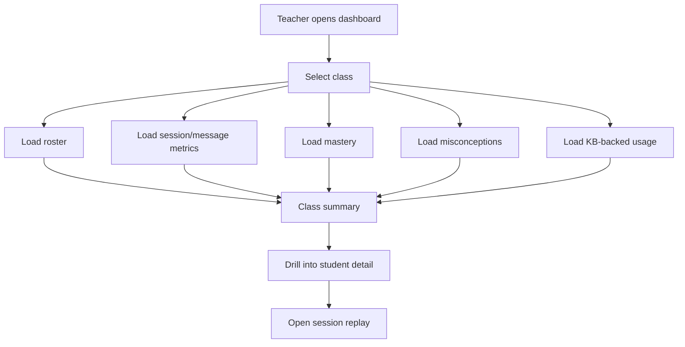

Outputs:

- class metrics
- student-level summaries
- replay access

### 6.7 Co-Pilot and Reporting

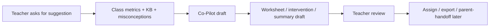

Outputs:

- worksheet drafts
- intervention suggestions
- conference prep drafts
- parent summary drafts

---

## 7. Mapping to Student Profile Later

The teacher section should expose downstream interfaces that the student plan will later consume.

### Student profile dependencies

- linked teacher(s)
- enrolled classes
- assigned KBs
- class-level persona defaults
- session history
- mastery summaries
- misconception summaries

### Mapping diagram

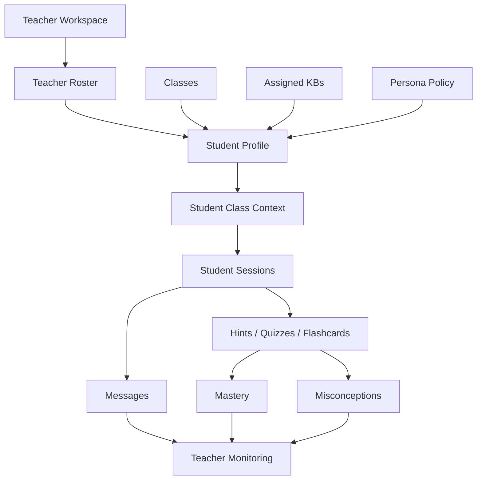

### Student profile rules to preserve

- student profile is self-view of student-owned activity
- teacher dashboard is scoped read-view of linked/enrolled students
- student sees assigned materials and class context later
- teacher-created policy/config influences the student experience but does not replace student ownership

---

## 8. API Surface

Current/near-term route groups:

- `/api/teacher/classes*`
- `/api/teacher/kb*`
- `/api/tutor/progress/teacher`
- `/api/tutor/classes`

Planned teacher route groups:

- `/api/teacher/roster`
- `/api/teacher/join-requests`
- `/api/teacher/join-codes`
- `/api/teacher/personas`
- `/api/teacher/monitoring`
- `/api/teacher/session-replay`
- `/api/teacher/analytics/class/{id}`
- `/api/teacher/analytics/students/{id}`
- `/api/teacher/analytics/struggling`
- `/api/teacher/copilot/suggest`
- `/api/teacher/copilot/worksheet`
- `/api/teacher/reports`
- `/api/teacher/communications`
- `/api/teacher/assessments`

---

## 9. Acceptance Criteria

- teacher lands in teacher dashboard inside same app shell
- teacher cannot see unrelated students
- admin can see global data
- teacher can manage roster links and classes separately
- teacher can assign KBs and personas to classes
- teacher can observe student activity only for linked/enrolled students
- teacher can generate review-only co-pilot outputs
- student-facing later plan can consume class, KB, and persona mappings without redesigning teacher ownership

---

## 10. Non-Goals For This Phase

- separate teacher application
- full parent implementation
- full student profile implementation
- marketplace
- LMS sync execution
- school-wide analytics beyond teacher/admin scope separation

---

## 11. Implementation Notes

Implemented in repo now:

- `/api/teacher/roster`, `/api/teacher/join-codes`, `/api/teacher/join-requests`
- `/api/tutor/classes/join` for student class self-join with auto-link
- `/api/teacher/personas` with class-level policy assignment and preview
- `/api/teacher/analytics/*`, `/api/teacher/session-replay/*`, `/api/teacher/monitoring`
- `/api/teacher/copilot/*`, `/api/teacher/reports`, `/api/teacher/communications`
- `/api/teacher/assessments*`
- frontend `Teacher Control Center` inside the same app shell

Testing reference:

- see `tech-docs/phase-2/TEACHER_TESTING_GUIDE.md` for exact accounts, seeded data, invite codes, and teacher-only validation order
