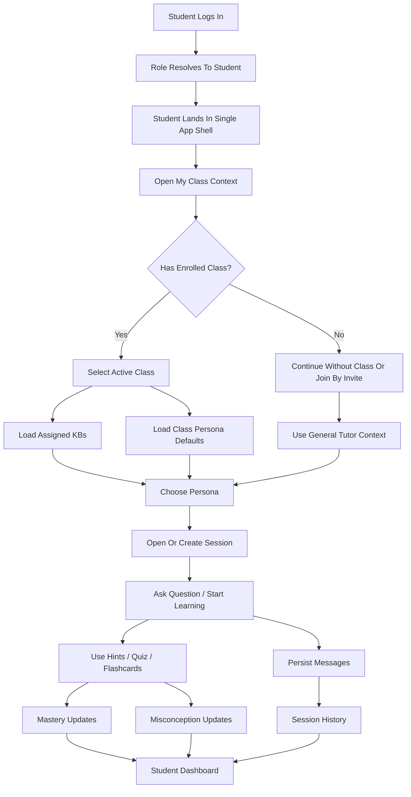
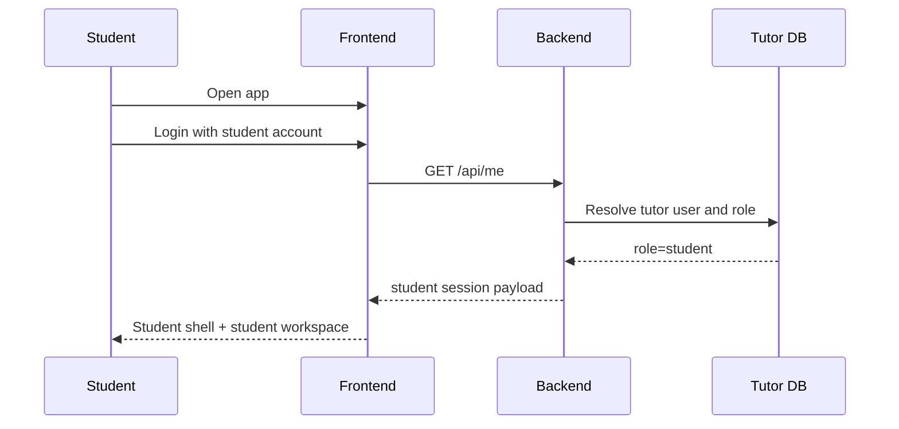
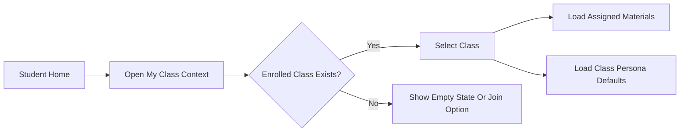
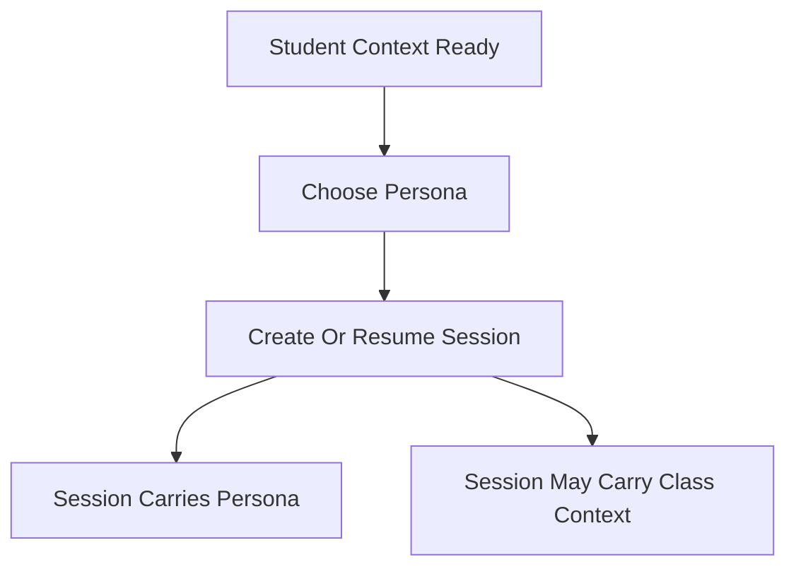
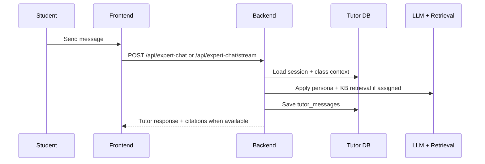
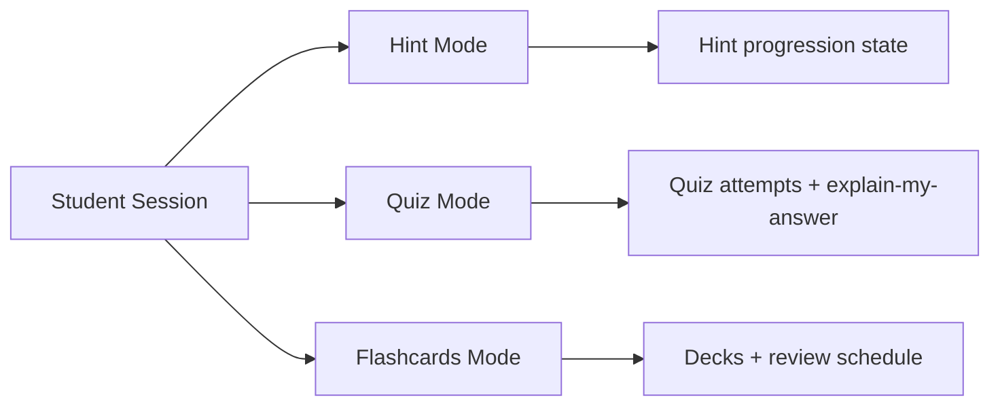
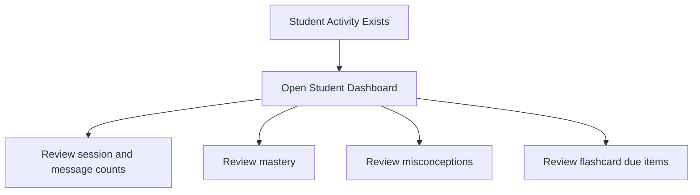
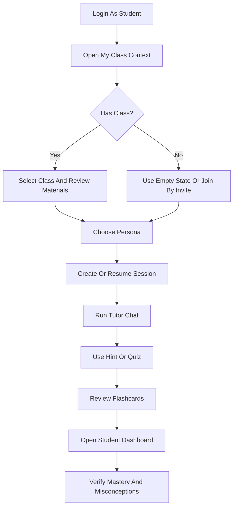

# Student Workflow Diagram

> Date: 2026-03-27
> Scope: Detailed student flow inside the single tutor app shell
> Purpose: Show what the student should start with first, what depends on what, and how the full student experience should flow in practice

---

## 1. Start Order

Use this order when testing or demonstrating the student workflow:

1. student login and role landing
2. student class context review
3. class selection or no-class fallback
4. persona selection
5. session start or session resume
6. tutor chat
7. hints, quizzes, or flashcards
8. mastery and misconception review
9. student dashboard review
10. teacher read-side verification later if needed

This order matters because:

- assigned materials are easier to reason about after class context loads
- session behavior is clearer after persona and class context are chosen
- dashboard and progress review are not meaningful before activity exists
- teacher monitoring should be checked only after student-owned activity is created

---

## 2. High-Level Flow

---

## 3. Detailed Student Workflow

### Phase A. Student Identity And Landing

Student starts here first.

Expected result:

- student is inside the same app shell as everyone else
- student sees tutor workspace and student progress surfaces
- teacher/admin controls are not the primary workspace

What to verify first:

- login succeeds
- role resolves to `student`
- student sees self-scoped workspace controls

---

### Phase B. Class Context

Student should load class context before interpreting assigned materials.

Why this comes early:

- assigned KBs depend on class context
- class persona defaults depend on class context
- session context is clearer after class selection

Student actions:

1. open `My Class Context`
2. select an enrolled class if one exists
3. review assigned materials
4. note whether a class persona default exists

Outputs:

- active class context
- assigned materials view
- class tutor defaults view

---

### Phase C. Persona And Session Setup

Student chooses how tutoring starts.

Student actions:

1. choose a tutor persona
2. create a new session or resume an existing one
3. confirm class-aware context if using a class
4. confirm active tutoring mode

Important rules:

- session remains student-owned
- class defaults can influence tutoring style
- student still owns resulting session and messages

Outputs:

- active session
- selected persona
- optional class-scoped tutoring context

---

### Phase D. Tutor Chat

Student now starts the real tutoring loop.

Student actions:

1. ask a question
2. review citations when class KBs are assigned
3. continue the conversation
4. confirm history persists in session

Outputs:

- saved messages
- KB-backed response when available
- reusable session history

---

### Phase E. Learning Tools

Student should now use the supporting learning tools.

Student actions:

1. start a hint progression
2. run a quiz
3. use `Explain My Answer`
4. generate or review flashcards

Outputs:

- hint records
- quiz records
- mistake and misconception signals
- flashcard review records

---

### Phase F. Dashboard And Review

Student reviews the learning result after activity exists.

Student actions:

1. open dashboard
2. review mastery changes
3. review misconceptions
4. decide whether to resume a session or review flashcards

Outputs:

- student-owned progress summary
- next-action review loop

---

## 4. Recommended Real Testing Path

If you want the most realistic student test sequence, do it in exactly this order:

---

## 5. Quick Decision Rules

When unsure what comes first:

- if login fails, stop at role resolution first
- if no class exists, use empty-state tutoring or join by invite before testing assigned materials
- if no session exists, create one before testing chat or learning tools
- if no activity exists, do not test dashboard depth yet
- if no KB is assigned, expect general tutoring rather than citation-backed class tutoring

---

## 6. Expected Student Mental Model

The student workflow should feel like this:

1. understand my current class context
2. choose how I want the tutor to help me
3. start or resume learning
4. use chat and learning tools
5. review my own progress
6. decide what to study next

That is the intended student flow for both implementation and testing.
