# Teacher Workflow Diagram

> Date: 2026-03-27
> Scope: Detailed teacher flow inside the single tutor app shell
> Purpose: Show what the teacher should start with first, what depends on what, and how the full teacher experience should flow in practice

---

## 1. Start Order

Use this order when testing or demonstrating the teacher workflow:

1. teacher login and role landing
2. teacher class selection or class creation
3. teacher roster and join/invite setup
4. student linking and class enrollment
5. KB assignment to class
6. class persona policy setup
7. student activity inside that class
8. teacher monitoring and session replay
9. teacher co-pilot drafts and reports
10. teacher assessments

This order matters because:

- monitoring is not meaningful before students exist
- class policy is not meaningful before a class exists
- KB and persona assignment should happen before student tutoring activity
- reports and interventions depend on monitoring data

---

## 2. High-Level Flow

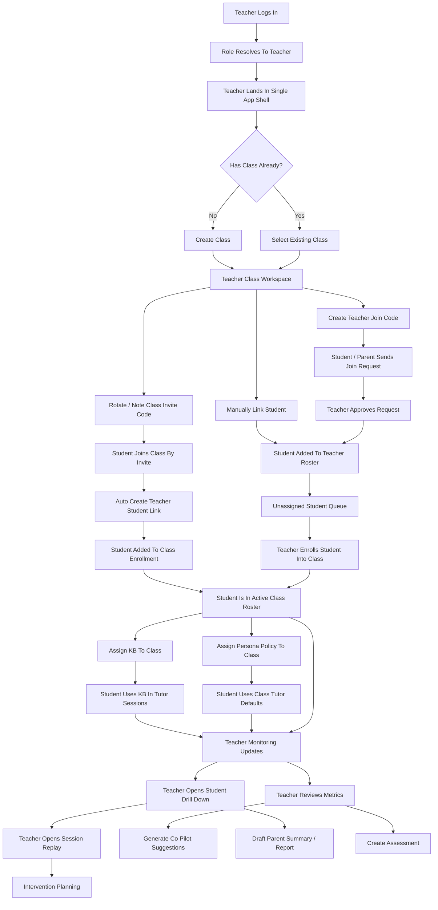

---

## 3. Detailed Teacher Workflow

### Phase A. Teacher Identity And Landing

Teacher starts here first.

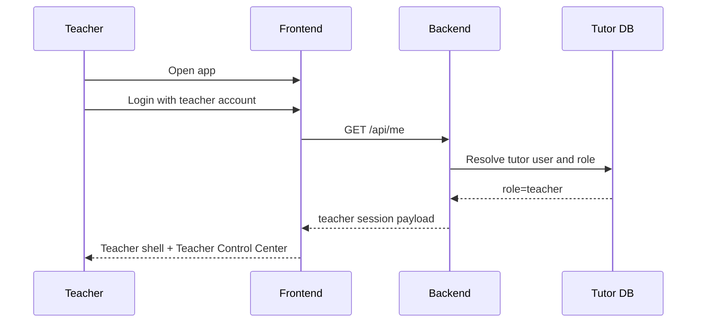

Expected result:

- teacher is inside the same app shell as everyone else
- teacher-only controls are visible
- student-only self-view is not the primary workspace

What to verify first:

- login succeeds
- role resolves to `teacher`
- teacher sees class, roster, KB, monitoring, reports, and assessment controls

---

### Phase B. Class Setup

Teacher should create or choose a class before doing anything else substantial.

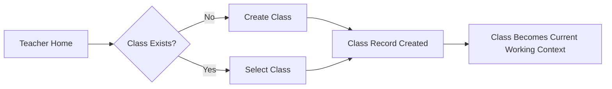

Why this comes early:

- enrollment depends on a class
- KB assignment depends on a class
- persona policy depends on a class
- monitoring is class-centered

Teacher actions:

1. open `Class & Roster Basics`
2. create a class if none exists
3. select the class that will be used as the active teacher workspace
4. note the class invite code

Outputs:

- class record
- class invite code
- selected teacher working context

---

### Phase C. Teacher Roster And Join Handshake

Teacher roster is separate from class roster. That is a key rule.

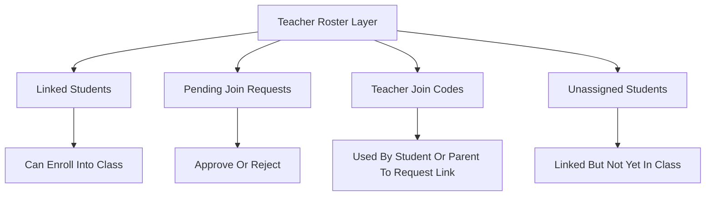

Teacher actions:

1. create a teacher join code
2. optionally link a student manually by `tutor_user_id`
3. review pending join requests
4. approve or reject requests
5. review the unassigned linked-student queue

Important rules:

- linked student does not automatically mean class enrollment
- teacher can have students in roster before class placement
- teacher should not see unrelated students globally

Outputs:

- linked teacher-student relationship
- pending request history
- unassigned student queue

---

### Phase D. Class Enrollment

Once students are linked, teacher places them into class.

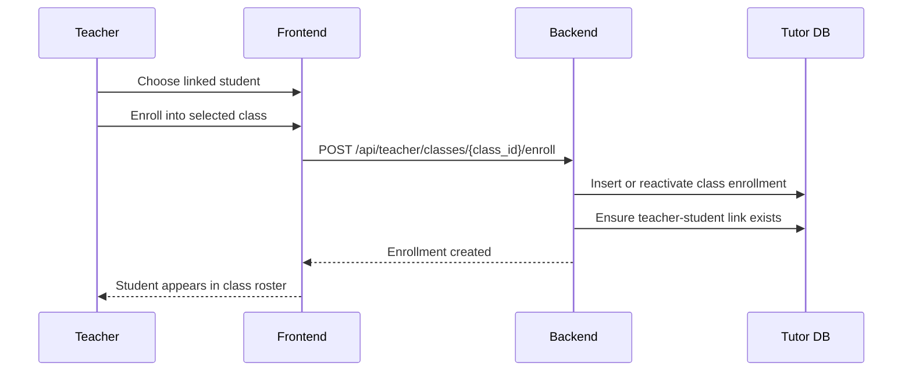

Alternative path:

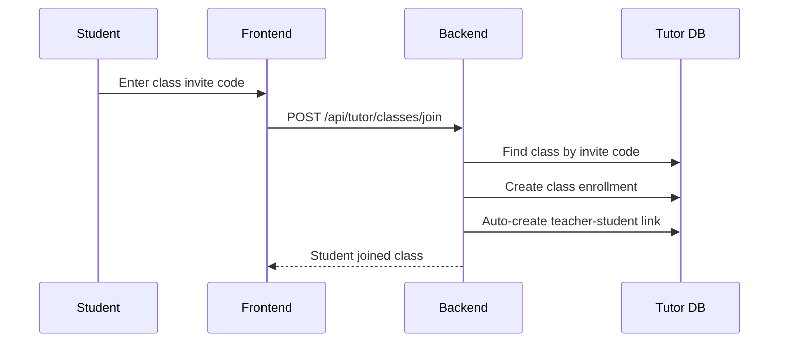

Teacher actions:

1. enroll a linked student manually
2. or provide class invite code for student self-join
3. confirm student appears in class roster
4. confirm teacher roster link exists

Outputs:

- class enrollment
- linked student visible in both teacher roster and class context

---

### Phase E. Knowledge Base Assignment

After a class has students, assign content and materials.

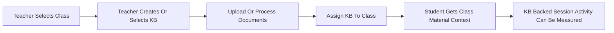

Teacher actions:

1. open `Knowledge Base Manager`
2. create or choose a KB
3. upload documents if needed
4. process documents
5. assign KB to selected class

Why here:

- KB should be in place before student activity if you want meaningful RAG-backed learning sessions

Outputs:

- KB record
- KB documents
- KB class assignment

---

### Phase F. Persona Policy Setup

Now define how the tutor should behave for this class.

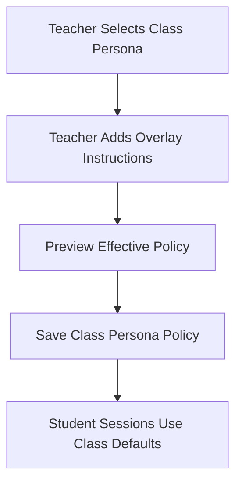

Teacher actions:

1. open `Class Persona Policy`
2. choose a base tutor persona
3. add overlay instructions
4. preview the policy
5. save the policy to the class

Examples of overlay instruction intent:

- enforce short step-by-step explanations
- push retrieval checks at the end of each response
- prefer evidence-based explanations
- keep tone more formal or more encouraging for that class

Outputs:

- class persona default
- class overlay instructions
- effective prompt preview

---

### Phase G. Student Learning Activity

Teacher setup is done. Student learning activity can now produce monitoring signals.

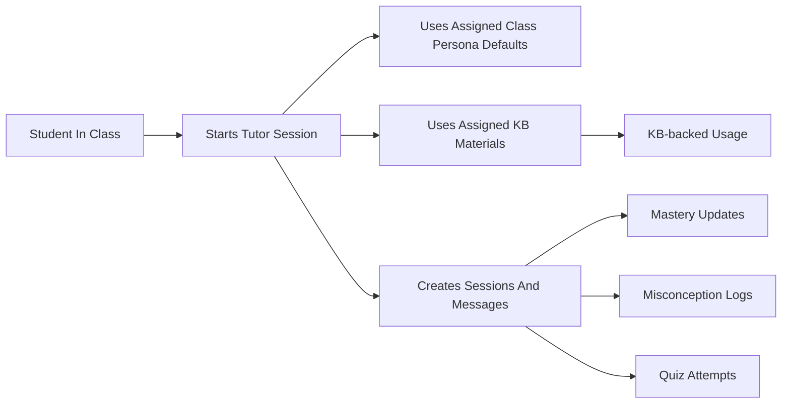

This phase is important because without it:

- replay has nothing useful to show
- struggling queue is weak
- reports are shallow
- co-pilot suggestions are generic

---

### Phase H. Monitoring And Session Replay

This is the main teaching intelligence loop.

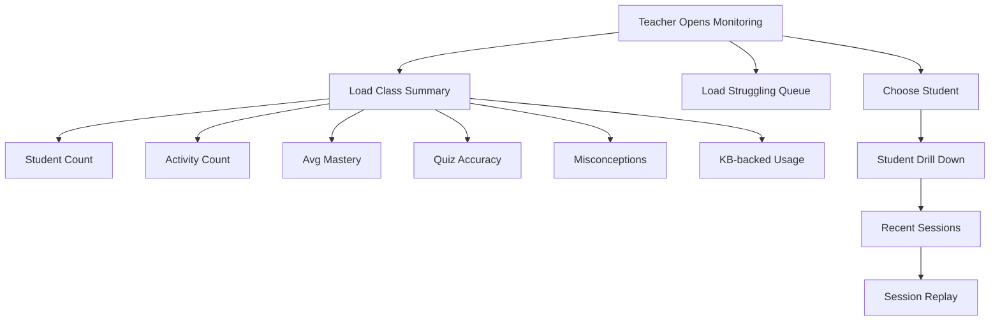

Teacher actions:

1. open monitoring
2. review class summary
3. check struggling or inactive students
4. click into one student
5. open recent session replay
6. inspect message-level evidence before intervention

Outputs:

- class metrics
- student drill-down
- session replay evidence
- at-risk/struggling queue

---

### Phase I. Co-Pilot, Reports, And Parent Summary Drafts

Only after monitoring produces evidence should teacher generate drafts.

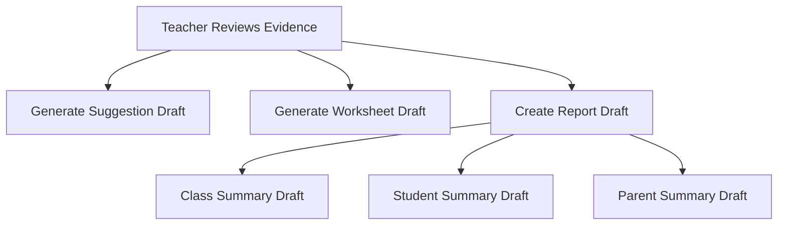

Teacher actions:

1. generate intervention suggestions
2. generate worksheet draft
3. save report draft
4. review saved drafts

Important rule:

- drafts are review-only
- no automatic mutation of student data
- teacher remains the final decision-maker

Outputs:

- intervention suggestion draft
- worksheet draft
- report draft
- parent-handoff draft

---

### Phase J. Assessments

Teacher assessment authoring comes after class and instructional setup.

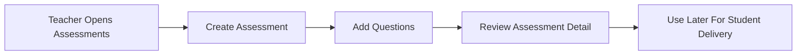

Teacher actions:

1. open `Assessments`
2. create an assessment
3. add questions
4. review saved assessment detail

Outputs:

- assessment record
- question bank

---

## 4. Recommended Real Testing Path

If you want the most realistic teacher test sequence, do it in exactly this order:

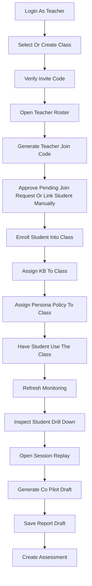

---

## 5. Quick Decision Rules

When unsure what comes first:

- if no class exists, create/select class first
- if no students are linked, do roster/join flow first
- if students are linked but not in class, enroll them next
- if class has no instructional setup, assign KB and persona next
- if class has no student activity, generate activity before testing monitoring
- if monitoring is empty, do not test reports yet

---

## 6. Expected Teacher Mental Model

The teacher workflow should feel like this:

1. establish my class context
2. establish who my students are
3. place students into classes
4. configure what the tutor should know and how it should teach
5. let students work
6. review evidence
7. decide interventions
8. draft communications and assessments

That is the intended teacher flow for both implementation and testing.

