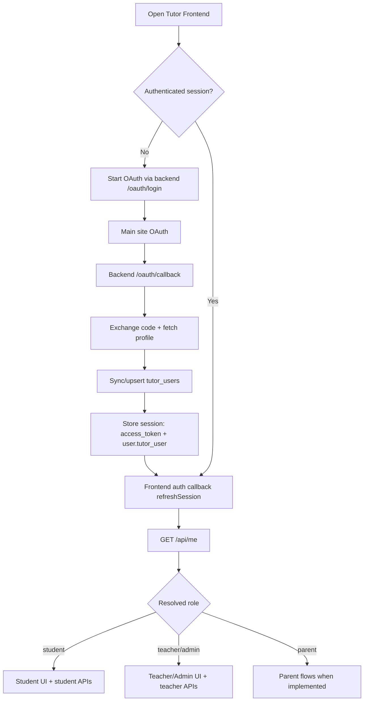

# User Flows and Diagrams: How the Tutor App Actually Works

Last updated: 2026-03-24

This document is the practical guide for understanding login, roles, and feature access in this repo.

Canonical role packs:

- Student: `tech-docs/phase-2/PHASE_2_STUDENT_SECTION_PLAN.md`
- Teacher: `tech-docs/phase-2/PHASE_2_TEACHER_SECTION_PLAN.md`
- Admin: `tech-docs/phase-2/PHASE_2_ADMIN_SECTION_PLAN.md`
- Parent: `tech-docs/phase-2/PHASE_2_PARENT_SECTION_PLAN.md`

## 1) Start Here (If You Are Confused)

Do these 4 checks first:

1. Confirm you can log in and `GET /api/me` returns a user.
2. Confirm your local tutor DB row exists in `tutor_users`.
3. Check your `tutor_users.role` value (`student`, `teacher`, `parent`, or `admin`).
4. Use role-gated features based on that local tutor role, not main-site `user/admin` labels.

Important: the tutor app has its own role model. Main site role names do not directly control all tutor features unless mapped explicitly.

## 2) Architecture Responsibility (What Lives Where)

Main site (`C:\AISITENEW`):
- OAuth login and token issuance
- Billing and subscription
- Credit/token deduction

Tutor site (`D:\USA\clever-ai-tutor`):
- Tutor experts/personas
- Chat and streaming
- Session/message persistence
- Class management
- Teacher KB and RAG
- Student/teacher dashboards
- Tutor role resolution and RBAC enforcement

Rule: tutor app does not proxy tutor features to main site.

## 3) Real Login and Session Flow (Current Code)

Code references:
- Backend OAuth callback: `backend/app/routers/auth.py`
- Tutor user sync: `backend/app/services/tutor_user_sync.py`
- RBAC role resolver: `backend/app/services/rbac.py`
- Frontend callback page: `frontend/app/auth/callback/page.tsx`

Flow:

1. Frontend starts login (backend `/oauth/login`).
2. Main site OAuth completes and redirects to backend `/oauth/callback`.
3. Backend exchanges auth code for token and fetches provider profile.
4. Backend calls tutor user sync (upsert into `tutor_users`).
5. Backend stores session cookie with `access_token` and `user.tutor_user` payload.
6. Frontend callback page runs `refreshSession()`.
7. Frontend calls `GET /api/me` and receives `{ user, access_token, role }`.
8. UI enables/disables teacher/admin areas based on returned role.

## 4) Role Truth (Why You See Student/Teacher Here)

The tutor app accepts only:
- `student`
- `teacher`
- `parent`
- `admin`

Current sync behavior (`tutor_user_sync.py`):
- Reads `provider_user.role` from main site profile.
- If role is not one of valid tutor roles, defaults to `student`.
- Upserts that into local `tutor_users.role` every login.

That means:
- Main role `admin` -> valid in tutor -> stays `admin`
- Main role `user` -> not valid tutor role -> becomes `student`

This is the root reason for confusion.

## 5) Where Role Is Actually Read At Runtime

`GET /api/me` returns role from backend resolver:

1. Prefer `user.tutor_user.role` (local tutor role synced at login).
2. Fallback to `user.role` only if valid tutor role.

So tutor behavior is driven by tutor role resolution, not by raw main-site role labels.

## 6) Student Flow (What Happens)

Student-visible capabilities:
- Chat and tutoring modes
- Quiz/hints/flashcards/misconception tools
- Student progress dashboard

Typical request path:
- Login -> `/api/me` role=`student`
- Use tutoring endpoints and student dashboard
- Teacher-only APIs remain blocked by RBAC

Detailed student references:

- `tech-docs/phase-2/STUDENT_WORKFLOW_DIAGRAM.md`
- `tech-docs/phase-2/STUDENT_TESTING_GUIDE.md`

## 7) Teacher/Admin Flow (What Happens)

Teacher/admin capabilities:
- Class CRUD and roster operations (`/api/teacher/classes*`)
- KB create/upload/process/retrieve (`/api/teacher/kb*`)
- Teacher progress dashboard (`/api/tutor/progress/teacher?class_id=...`)

RBAC checks allow `teacher` or `admin` for teacher routes.

Detailed teacher references:

- `tech-docs/phase-2/TEACHER_WORKFLOW_DIAGRAM.md`
- `tech-docs/phase-2/TEACHER_TESTING_GUIDE.md`

Detailed admin references:

- `tech-docs/phase-2/ADMIN_WORKFLOW_DIAGRAM.md`
- `tech-docs/phase-2/ADMIN_TESTING_GUIDE.md`

## 8) Parent Flow (What Happens)

Parent-visible current capabilities:

- local role resolution and shell gating
- future linked-child dashboard and reports remain scaffolded

Detailed parent references:

- `tech-docs/phase-2/PARENT_WORKFLOW_DIAGRAM.md`
- `tech-docs/phase-2/PARENT_TESTING_GUIDE.md`

## 9) Mermaid Diagram: End-to-End



## 10) How To Verify Your Current Role Quickly

Use Postgres and inspect `tutor_users`:

```sql
SELECT id, root_user_id, role, display_name, created_at, updated_at
FROM tutor_users
ORDER BY updated_at DESC
LIMIT 20;
```

Current behavior (updated): if your local tutor role is higher-priority (for example `teacher` or `admin`), login sync keeps it unless the provider explicitly sends an equal/higher valid tutor role.

## 11) Recommended Role Strategy (So Team Stops Getting Stuck)

Pick one strategy and document it in both repos.

Recommended now:
- `main.admin` -> `tutor.admin`
- `main.user` -> default `tutor.student`
- Teacher assignment managed inside tutor app (admin action updates `tutor_users.role='teacher'`)
- Login sync must not downgrade local `teacher` back to `student` unless explicitly intended

Without this policy, teacher access will be inconsistent.

## 12) Practical Next Steps (Order)

1. Finalize role mapping policy (above) with team.
2. Implement/adjust sync logic so local teacher role is preserved as intended.
3. Add an admin-only endpoint or script to promote users to `teacher` in tutor DB.
4. Test with two accounts:
   - account A -> student
   - account B -> teacher/admin
5. Update this doc and checklist after behavior is confirmed.

## 13) Endpoint Map (Quick Reference)

Auth/session:
- `GET /oauth/login`
- `GET /oauth/callback`
- `GET /api/me`
- `POST|GET /api/logout`

Teacher class:
- `POST /api/teacher/classes`
- `GET /api/teacher/classes`
- `GET /api/teacher/classes/{class_id}`
- `POST /api/teacher/classes/{class_id}/enroll`
- `POST /api/teacher/classes/{class_id}/remove`

Teacher KB:
- `POST /api/teacher/kb`
- `GET /api/teacher/kb`
- `POST /api/teacher/kb/{kb_id}/documents`
- plus processing/retrieval endpoints under `/api/teacher/kb/*`

Dashboards:
- `GET /api/tutor/progress/student`
- `GET /api/tutor/progress/teacher?class_id=...`

---

If this file and code ever disagree, treat code as source of truth and update this file immediately.
